# خواننده تلگرام

<!-- TOP_NAV START -->

<a href="https://github.com/AlirezaGh1993/aio-downloader/blob/main/telegram/content/archive_1.md" style="display:inline-block; padding:6px 12px; margin:0 4px; background-color:#2ea44f; color:white; text-decoration:none; border-radius:4px; font-weight:bold;">صفحه بعد</a>

<!-- TOP_NAV END -->

<!-- MSG START -->

---
📅 بروزرسانی: 1405/02/28 22:43
---

## VahidOOnLine — post 240847

♦️همکاری تازه شرکت سواچ با نشان تجاری لوکس و مشهور «اودمار پیگه» موجی از هیجان در بازار ساعت ایجاد کرده و ساعت‌های این مجموعه محدود اکنون با قیمت‌هایی چندین برابر نرخ اولیه در بازار خرید و فروش دوباره عرضه می‌شوند. این تب خرید در برخی شهرها به ازدحام شدید، کتک‌کاری و حتی تعطیلی فروشگاه‌ها منجر شده است.
به گزارش نیویورک‌پست، طرح «رویال پاپ» که ترکیبی از طراحی مشهور «رویال اوک» اودمار پیگه و مجموعه «پاپ» سواچ در دهه ۱۹۸۰ است، با قیمت اولیه حدود ۴۰۰ دلار عرضه شد اما به‌سرعت به یکی از داغ‌ترین کالاهای بازار خرید و فروش دوباره تبدیل شد. برخی آگهی‌ها در سایت‌های فروش اینترنتی قیمت‌هایی بیش از ۹ هزار دلار برای این ساعت‌ها ثبت کرده‌اند و مجموعه کامل هشت‌تایی آن نیز تا حدود ۲۲ هزار دلار قیمت‌گذاری شده است.
فروشندگان بازار جواهرات نیویورک نیز از تقاضای بالا برای برخی رنگ‌های خاص خبر داده‌اند و می‌گویند کمیابی و عرضه محدود این همکاری تازه، عامل اصلی افزایش شدید قیمت‌ها بوده است.
هم‌زمان گزارش‌ها از هرج‌ومرج در فروشگاه‌های سواچ در نیویورک و چند شهر دیگر حکایت دارد؛ جایی که صدها نفر برای خرید این ساعت‌ها روزها در صف ماندند. ازدحام به حدی رسید که برخی شعب به دلیل نگرانی‌های امنیتی به‌طور موقت تعطیل شدند.
‌🇸🇦 Indypersian

🤖 @VahidOOnLine

## VahidOOnLine — post 240846

  

مسعود پزشکیان در شبکه ایکس نوشت: «گفت‌وگو به معنای تسلیم نیست. جمهوری اسلامی با عزت، اقتدار و حفظ حقوق ملت وارد گفت‌وگو می‌شود و به هیچ عنوان از حقوق قانونی مردم و کشور عقب‌نشینی نمی‌کند.»
او افزود: «ما با منطق و با تمام توان، تا پای جان، در خدمت مردم و حافظ منافع و عزت ایران خواهیم بود.»
‌🏁 🇬🇧 IranintlTV

🤖 @VahidOOnLine

## VahidOOnLine — post 240845

  

وزارت امور خارجه پاکستان روز دوشنبه ۲۸ اردیبهشت‌ماه با انتشار بیانیه‌ای، حملات پهپادی علیه عربستان سعودی را «با شدیدترین لحن ممکن» محکوم کرد و آن را نقض حاکمیت و تمامیت ارضی عربستان سعودی دانست.

در این بیانیه آمده است این حملات تلاشی برای تضعیف صلح و ثبات منطقه‌ای به شمار می‌رود و دولت و مردم پاکستان در این شرایط در کنار عربستان سعودی ایستاده‌اند.

اسلام‌آباد همچنین بار دیگر حمایت کامل و قاطع خود را از امنیت، صلح و رفاه عربستان سعودی اعلام کرد.

پیشتر وزارت دفاع عربستان سعودی اعلام کرده بود سه پهپاد که از سمت حریم هوایی عراق وارد آسمان این کشور شده بودند، رهگیری و منهدم شدند. ترکی المالکی، سخنگوی رسمی وزارت دفاع عربستان سعودی، تاکید کرده بود ریاض حق پاسخ‌گویی در زمان و مکان مناسب را برای خود محفوظ می‌داند و اقدامات لازم برای حفاظت از حاکمیت و امنیت کشور را انجام خواهد داد.
‌🇸🇦 Indypersian

🤖 @VahidOOnLine

## VahidOOnLine — post 240844

  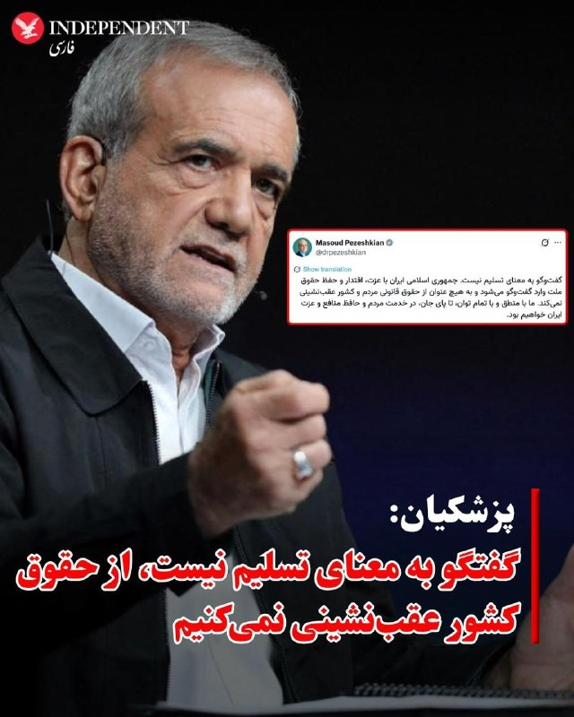

♦️مسعود پزشکیان، رئیس‌جمهوری ایران، شامگاه دوشنبه در پیامی در شبکه اجتماعی ایکس نوشت گفتگو به معنای تسلیم نیست و جمهوری اسلامی در مذاکرات از «حقوق مردم و کشور عقب‌نشینی» نخواهد کرد.

پزشکیان نوشت: «جمهوری اسلامی ایران با عزت، اقتدار و حفظ حقوق ملت وارد گفتگو می‌شود و به هیچ عنوان از حقوق قانونی مردم و کشور عقب‌نشینی نمی‌کند.»

رئیس‌جمهوری ایران همچنین افزود: «ما با منطق و با تمام توان، تا پای جان، در خدمت مردم و حافظ منافع و عزت ایران خواهیم بود.»

این اظهارات در شرایطی مطرح می‌شود که دونالد ترامپ از آخرین طرح ۱۴ ماده‌ای تهران برای پایان جنگ ابراز نارضایتی کرده و گفته است «به هیچ وجه حاضر به دادن امتیاز» به ایران نیست.
‌🇸🇦 Indypersian

🤖 @VahidOOnLine

## VahidOOnLine — post 240843

  

لیندسی گراهام، سناتور جمهوری‌خواه، در شبکه ایکس نوشت: «اطمینان کامل دارم که ترامپ به‌خوبی وضعیت ایران را درک می‌کند و در برابر ادامه خودداری جمهوری اسلامی از مذاکره صادقانه، همراه با اقدامات تهاجمی این کشور در تنگه هرمز و سراسر منطقه، مماشات نخواهد کرد.»

او افزود: «یک پاسخ کوتاه اما قاطع می‌تواند مسیر درگیری را به‌درستی تغییر دهد. در مواجهه با جمهوری اسلامی، ضروری است که از موضع قدرت و برتری وارد مذاکره شویم.»
‌🏁 🇬🇧 IranintlTV

🤖 @VahidOOnLine

## VahidOOnLine — post 240842

  <a href="telegram/content/VahidOOnLine_240842_1779131587.mp4" target="_blank">🎬 Download video</a>

تماسی از ایران:
از سیروان شعبانی، ۲۲ ساله از اسلامشهر گفت…
استاد موسیقی که نوزدهم دی بازداشت شد و حالا در اوین است
‌🏁 🇬🇧 ManotoTV

🤖 @VahidOOnLine

## VahidOOnLine — post 240841

  <a href="telegram/content/VahidOOnLine_240841_1779131589.mp4" target="_blank">🎬 Download video</a>

دونالد ترامپ، رئیس‌جمهوری آمریکا، در گفت‌وگو با نیویورک پست اعلام کرد پس از دریافت تازه‌ترین پاسخ «ناامیدکننده» جمهوری اسلامی در مذاکرات مربوط به توافق صلح، «برای هیچ‌گونه امتیازدهی به تهران آمادگی ندارد.»

ترامپ همچنین در اظهاراتی هشدارآمیز گفت جمهوری اسلامی می‌داند «به‌زودی چه اتفاقی قرار است بیفتد.»

او در این گفت‌وگوی کوتاه تلفنی، به نظر می‌رسید پیشنهاد جمهوری اسلامی برای ادامه مذاکرات دیپلماتیک، که روز یکشنبه مطرح شده بود، را رد کرده است.

ترامپ در پاسخ به سوالی درباره اظهارات روز جمعه‌اش مبنی بر آمادگی برای پذیرش توقف ۲۰ ساله غنی‌سازی اورانیوم در ایران گفت: «در حال حاضر برای هیچ چیزی آمادگی ندارم.»

رئیس‌جمهوری آمریکا از ارائه جزئیات بیشتر خودداری کرد و گفت: «واقعاً نمی‌توانم درباره‌اش صحبت کنم. اتفاقات زیادی در حال رخ دادن است.»

بر اساس این گزارش، ترامپ پس از بازگشت از سفرش به چین، آخر هفته را در باشگاه گلف خود در ویرجینیا همراه با تیم امنیت ملی آمریکا به بررسی گام‌های بعدی درباره جمهوری اسلامی گذرانده است.

نیویورک پست نوشت انتظار می‌رود نشست‌های بیشتری روز سه‌شنبه برگزار شود؛ در حالی که برخی متحدان تندرو ترامپ، از جمله لیندسی گراهام، سناتور جمهوری‌خواه، از او خواسته‌اند با متوقف شدن روند دیپلماسی، عملیات نظامی علیه جمهوری اسلامی را از سر بگیرد.

ترامپ همچنین گفت از تهران «ناامید» نشده، اما تاکید کرد جمهوری اسلامی به‌خوبی می‌داند آمریکا توان وارد کردن «فشار و آسیب بیشتر» را دارد.

او گفت: «می‌توانم بگویم آن‌ها بیشتر از هر زمان دیگری می‌خواهند توافق کنند، چون می‌دانند ما… چه اتفاقی قرار است به‌زودی بیفتد.»

ترامپ در پاسخ به سوالی درباره گزارش‌هایی مبنی بر تلاش جمهوری اسلامی برای «وقت‌کشی» در موضوع هسته‌ای و بازگشایی تنگه هرمز گفت چنین چیزی نشنیده است.

او افزود: «چیزی نمی‌شنوم. نمی‌توانم درباره‌اش با شما صحبت کنم.»

ترامپ در پایان گفت: «این یک مذاکره است. نمی‌خواهم احمق باشم.»
‌🏁 🇬🇧 ManotoTV

🤖 @VahidOOnLine

## VahidOOnLine — post 240840

  <a href="telegram/content/VahidOOnLine_240840_1779131589.mp4" target="_blank">🎬 Download video</a>

تماسی از ایران:
« از جاویدنام علی اباذری می‌گفت…
با گذشت ماه‌ها، درد هنوز تازه‌ست؛ انگار همین دیروز اتفاق افتاده.»
‌🏁 🇬🇧 ManotoTV

🤖 @VahidOOnLine

## VahidOOnLine — post 240839

  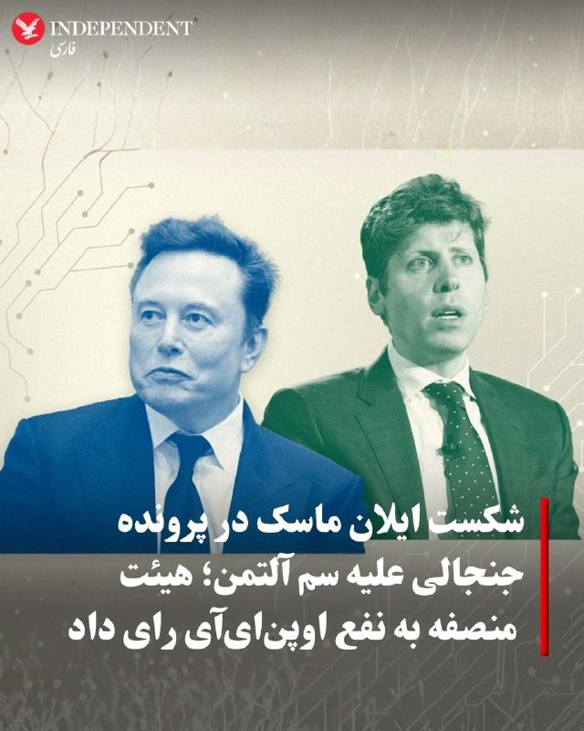

♦️هیئت منصفه یک دادگاه فدرال در آمریکا روز دوشنبه به زیان ایلان ماسک در پرونده حقوقی علیه اوپن‌ای‌آی رای داد و یکی از جنجالی‌ترین نبردهای قضایی سیلیکون‌ولی را به پایان رساند.

به گزارش خبرگزاری فرانسه، هیئت منصفه دادگاه فدرال اوکلند اعلام کرد ماسک برای طرح شکایت علیه اوپن‌ای‌آی و بنیان‌گذاران آن بیش از حد تاخیر کرده و ادعاهای او مشمول محدودیت زمانی قانونی شده است. قاضی ایوون گونزالس راجرز نیز رای هیئت منصفه را تایید کرد.

در این پرونده، ایلان ماسک از سم آلتمن، مدیرعامل اوپن‌ای‌آی، گرگ براکمن، رئیس این شرکت، بنیاد اوپن‌ای‌آی و همچنین مایکروسافت شکایت کرده بود، اما هیئت منصفه استدلال‌های اصلی او را نپذیرفت.

ایلان ماسک، میلیاردر حوزه فناوری و مالک شبکه اجتماعی ایکس، در شکایت خود مدعی شده بود سم آلتمن، از هم‌بنیان‌گذاران اوپن‌ای‌آی که این شرکت را همراه با ماسک تأسیس کرده، از مسیر و مأموریت اولیه این پروژه فاصله گرفته و وعده فعالیت غیرانتفاعی چت‌جی‌پی‌تی و اوپن‌ای‌آی را کنار گذاشته است. ماسک همچنین او را به سوءاستفاده مالی و فریب متهم کرده بود.
‌🇸🇦 Indypersian

🤖 @VahidOOnLine

## VahidOOnLine — post 240838

  <a href="telegram/content/VahidOOnLine_240838_1779131592.mp4" target="_blank">🎬 Download video</a>

♦️همزمان با ادامه محاصره دریایی بنادر جنوبی ایران از سوی آمریکا، ستاد فرماندهی مرکزی آمریکا «سنتکام» روز دوشنبه ۲۸ اردیبهشت‌ماه با انتشار ویدیویی اعلام کرد نیروهای تحت فرماندهی این نهاد در آب‌های منطقه تاکنون ۸۵ کشتی تجاری را وادار به تغییر مسیر کرده‌اند.

سنتکام اعلام کرد این اقدام در چارچوب ادامه محاصره دریایی علیه جمهوری اسلامی انجام شده و مانع ورود یا خروج این کشتی‌ها به بنادر ایران شده است.
‌🇸🇦 Indypersian

🤖 @VahidOOnLine

## VahidOOnLine — post 240837

  <a href="telegram/content/VahidOOnLine_240837_1779131592.mp4" target="_blank">🎬 Download video</a>

♦️در ادامه تبلیغات حکومتی در دوران آتش‌بس و تلاش جمهوری اسلامی برای مدیریت فضای رسانه‌ای، یک زوج حامی حکومت در برنامه صداوسیما اعلام کردند مهریه عروس یک «پهپاد شاهد» تعیین شده است.

در این برنامه تلویزیونی، داماد که از حامیان جمهوری اسلامی معرفی شد، گفت امیدوار است این پهپاد «به قلب اسرائیل اصابت کند.»

این اظهارات در حالی مطرح شد که در هفته‌های اخیر، استفاده نمادین از پهپادها و تجهیزات نظامی در تجمع‌های حکومتی و برنامه‌های رسانه‌ای جمهوری اسلامی افزایش یافته است.
‌🇸🇦 Indypersian

🤖 @VahidOOnLine

## VahidOOnLine — post 240836

  <a href="telegram/content/VahidOOnLine_240836_1779131593.mp4" target="_blank">🎬 Download video</a>

‌
داده‌های ردیابی پروازها نشان می‌دهد انتقال هوایی تجهیزات و نیروهای نظامی آمریکا به خاورمیانه همچنان ادامه دارد.

بر اساس گزارش الجزیره از داده‌های پروازی، دست‌کم ۲۶ پرواز نظامی آمریکا بین ۱۵ تا ۱۷ مه از آلمان به مقصد خاورمیانه انجام شده است.

این گزارش می‌گوید این جابه‌جایی‌ها همزمان با افزایش حضور نظامی آمریکا در اطراف تنگه هرمز، دریای عمان و دریای عرب انجام شده است.

بر اساس داده‌های ردیابی، تمام پروازهای ثبت‌شده با هواپیماهای نظامی «بوئینگ سی-۱۷ اِی گلوب‌مستر ۳» انجام شده‌اند؛ هواپیماهای ترابری سنگینی که نیروی هوایی آمریکا از آن‌ها برای انتقال نیرو و تجهیزات نظامی استفاده می‌کند.
‌🏁 🇬🇧 ManotoTV

🤖 @VahidOOnLine

## VahidOOnLine — post 240835

  <a href="telegram/content/VahidOOnLine_240835_1779131593.mp4" target="_blank">🎬 Download video</a>

‌
وزارت خزانه‌داری آمریکا اعلام کرد مجوزی عمومی و موقت ۳۰ روزه صادر کرده تا «آسیب‌پذیرترین کشورها» بتوانند به‌طور موقت به نفت روسیه‌ای که در دریا سرگردان مانده، دسترسی پیدا کنند.

وزارت خزانه‌داری آمریکا گفت این تمدید «انعطاف‌پذیری بیشتری» فراهم می‌کند و واشینگتن در صورت نیاز، مجوزهای مشخص‌تری نیز برای این کشورها صادر خواهد کرد.

در این بیانیه آمده است این مجوز عمومی به «ثبات بازار فیزیکی نفت خام» کمک می‌کند و تضمین می‌کند نفت به کشورهایی برسد که بیشترین آسیب‌پذیری را در حوزه انرژی دارند.

وزارت خزانه‌داری آمریکا همچنین اعلام کرد این اقدام با کاهش توانایی چین برای انبار کردن نفت ارزان‌قیمت، به هدایت دوباره عرضه موجود به سمت کشورهای نیازمند کمک خواهد کرد.
‌🏁 🇬🇧 ManotoTV

🤖 @VahidOOnLine

## VahidOOnLine — post 240834

  

دونالد ترامپ در گفت‌وگویی کوتاه با نیویورک پست اعلام کرد که پس از دریافت پاسخ اخیر جمهوری اسلامی درباره مذاکرات، «هیچ تمایلی» به دادن هیچ‌گونه امتیاز به تهران ندارد.
او همچنین هشدار داد جمهوری اسلامی می‌داند «به‌زودی چه اتفاقی خواهد افتاد»، بدون آنکه جزئیات بیشتری ارائه کند.

ترامپ در پاسخ به پرسشی درباره اظهارنظرش درباره آمادگی برای پذیرش توقف ۲۰ ساله غنی‌سازی اورانیوم جمهوری اسلامی گفت: در حال حاضرآماده دادن هیچ امتیازی نیستم. واقعا نمی‌توانم درباره این موضوع صحبت کنم. اتفاقات زیادی در حال رخ دادن است.

ترامپ افزود که از تهران «عصبانی یا ناراحت» نیست، اما تاکید کرد جمهوری اسلامی به‌خوبی می‌داند آمریکا توان وارد کردن فشار و خسارت بیشتر را دارد. می‌توانم بگویم آن‌ها بیش از هر زمان دیگری خواهان توافق هستند، چون می‌دانند به‌زودی چه اتفاقی در راه است.

ترامپ: این یک مذاکره است و نمی‌خواهم اقدام احمقانه‌ای انجام دهم.
‌🏁 🇬🇧 IranintlTV

🤖 @VahidOOnLine

## VahidOOnLine — post 240833

  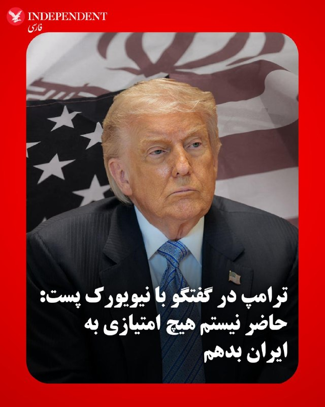

♦️دونالد ترامپ، رئیس جمهوری آمریکا، روز دوشنبه در گفتگو با نیویورک پست اعلام کرد که پس از دریافت آخرین پاسخ ناامیدکننده تهران در مذاکرات توافق صلح، «به هیچ وجه حاضر به دادن امتیاز» به ایران نیست.
ترامپ در مصاحبه تلفنی کوتاه، ضمن ابراز نارضایتی از آخرین پیشنهاد تهران گفت ایران می‌داند «به‌زودی چه اتفاقی خواهد افتاد».
به گزارش نیویورک پست، وقتی از ترامپ درباره اظهارنظر روز جمعه‌اش مبنی بر اینکه مایل به پذیرش تعلیق ۲۰ ساله غنی‌سازی اورانیوم ایران است سوال شد، جواب داد: «در حال حاضر به هیچ وجه آماده دادن امتیاز نیستم».
ترامپ ادامه داد: «من واقعا نمی‌توانم در این مورد با شما صحبت کنم. چیزهای بسیار زیادی در حال رخ دادن است».
رئیس جمهوری آمریکا همچنین گفت از تهران «ناامید یا کلافه» نشده، اما هم‌زمان تأکید کرد ایران به‌خوبی آگاه است که ایالات متحده می‌تواند فشار بیشتری وارد کند.
ترامپ گفت: «می‌توانم به شما بگویم آن‌ها بیش از هر زمان دیگری خواستار توافق هستند، زیرا آن‌ها می‌دانند ما...به‌زودی چه اتفاقی قرار است بیفتد».
وقتی درباره ادعاهای منابع منطقه‌ای مبنی بر اینکه ایران تلاش می‌کند در قبال هر دو مسئله هسته‌ای و بازگشایی تنگه هرمز در برابر واشنگتن «سیاست صبر و انتظار» پیش بگیرد، سوال شد، ترامپ گفت «چنین چیزی نشنیده است».
‌🇸🇦 Indypersian

🤖 @VahidOOnLine

## WithYashar — post 11585

اتاق جنگ با یاشار : یک پوکرباز خوب دستش را «شو» نمی‌کند، بلکه معمولاً فقط وقتی کارت‌ها را نشان می‌دهد که دست قوی را نشان ‌دهد تا تصویر «بازیکن صادق» بسازد و بعداً راحت‌تر بلوف بزند
@withyashar

## WithYashar — post 11584

فعالیت پدافند در شمال تهران شروع شد

منابع نزدیک به سپاه: انهدام ریزپرنده در شمال تهران
@withyashar

## WithYashar — post 11583

حمله فردا کنسل شد

ترامپ در تروث : از سوی امیر قطر، تمیم بن حمد آل ثانی، ولیعهد عربستان سعودی، محمد بن سلمان آل سعود، و رئیس‌ امارات متحده عربی، محمد بن زاید آل نهیان، از من درخواست شده است که حمله نظامی برنامه‌ریزی‌شده ما علیه جمهوری اسلامی ایران را که قرار بود فردا انجام شود، فعلاً متوقف کنم؛ زیرا اکنون مذاکرات جدی در جریان است و آن‌ها، به عنوان رهبران بزرگ و متحدان ما، معتقدند توافقی حاصل خواهد شد که برای ایالات متحده آمریکا و همچنین همه کشورهای خاورمیانه و فراتر از آن، بسیار قابل قبول خواهد بود.

این توافق، مهم‌تر از همه، شامل این خواهد بود که ایران هیچ سلاح هسته‌ای نداشته باشد.

بر پایه احترامم به رهبران یادشده، به وزیر جنگ، پیت هگست، رئیس ستاد مشترک نیروهای مسلح، ژنرال دنیل کین، و ارتش ایالات متحده دستور داده‌ام که حمله برنامه‌ریزی‌شده به ایران را فردا انجام ندهند. اما همزمان به آن‌ها دستور داده‌ام که در صورتی که توافقی قابل قبول حاصل نشود، آماده باشند تا در هر لحظه حمله‌ای کامل و گسترده علیه ایران را آغاز کنند.

از توجه شما به این موضوع سپاسگزارم!

رئیس‌جمهور دونالد جی. ترامپ
@withyashar

## WithYashar — post 11582

خدا بخواد به زودی تهران میرسه هر چی که هست 😂🙌🏾

## WithYashar — post 11581

اتاق جنگ با شما : یاشارررر
پدافند اصفهان چند دقیقه فعال شد
@withyashar

## WithYashar — post 11580

زرشکیان لو داد میخوان مذاکره کنن:

گفت‌وگو به معنای تسلیم نیست

جمهوری اسلامی با عزت، اقتدار و حفظ حقوق ملت وارد گفت‌وگو می‌شود و به هیچ عنوان از حقوق قانونی مردم و کشور عقب‌نشینی نمی‌کند.
ما با منطق و با تمام توان، تا پای جان، در خدمت مردم و حافظ منافع و عزت ایران خواهیم بود.
@withyashar

## WithYashar — post 11579

اتاق جنگ با شما : اره الان دوباره مجددا صدا اومد
جالبه تو دوران جنگ قبلی اصلا قشم پدافند این چنینی نداشت و ما اینجور صدایی رو واسه اولین بار هست تو قشم می‌شنویم
@withyashar

## WithYashar — post 11578

اتاق جنگ با شما : سلام یاشار
همین الان پدافند قشم بدجووووور زد
پدافند خود شهر قشم حتی توی جنگ ۴۰ روزه هم کار نکرده بود
ولی پنج دیقه پیش بدجور شلیک کرد
@withyashar

## WithYashar — post 11577

## WithYashar — post 11576

## WithYashar — post 11575

ترامپ: اگر فرد اشتباهی جانشین من شود، برای آمریکا فاجعه خواهد بود

رئیس‌جمهور آمریکا در مصاحبه‌ای که روز دوشنبه منتشر شد، گفت اگر پس از پایان دوره ریاست‌جمهوری‌اش «فرد اشتباهی» قدرت را به دست بگیرد، این موضوع برای ایالات متحده فاجعه‌بار خواهد بود.
@withyashar

## WithYashar — post 11574

تامین‌اجتماعی: دریافت فیش حقوقی اردیبهشت‌ماه فعلاً مقدور نیست و زمان آن متعاقباً اطلاع‌رسانی خواهد شد.
@withyashar

## WithYashar — post 11573

نظام وظیه: ۱۸ تا ۵۰ ساله ها بیایید خودتونو معرفی کنید که اگه جنگ شد بفرستیمتون با آمریکاییا بجنگید، تو محلتی که تعیین شده اگه نیایید تمام مزایاتون که به کارت پایان خدمت مربوطه قطع میشه
@withyashar

## WithYashar — post 11572

تا یکشنبه میزنم، قول میدم

## WithYashar — post 11571

  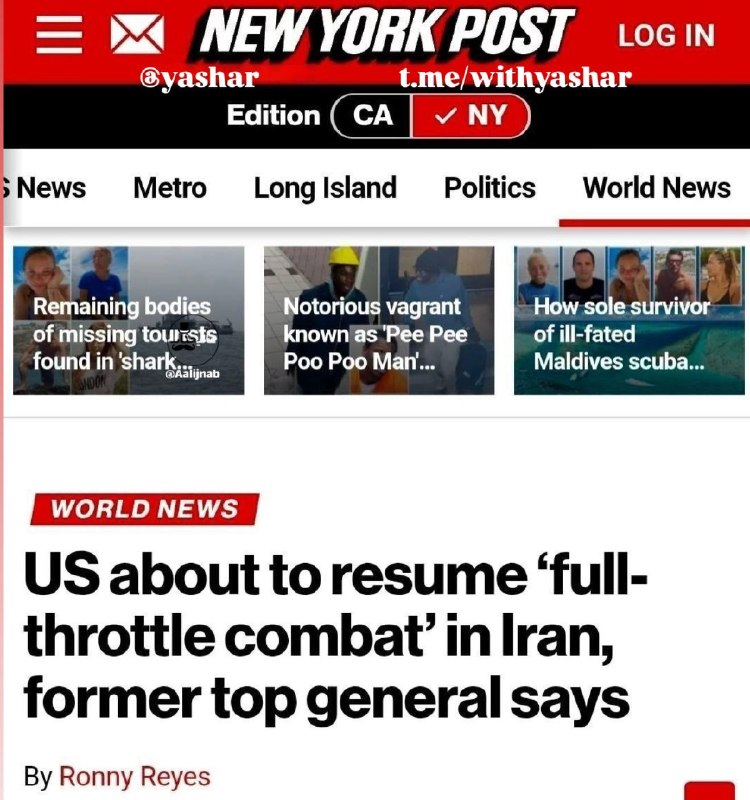

تیتر نیویورک پست:

ایالات متحده در آستانه از سرگیری نبرد با ایران با تمام توان است!
@withyashar

## WithYashar — post 11570

ترامپ:من از دست تهران «کلافه» نیستم

@withyashar

## WithYashar — post 11569

خبرنگار نیویورک‌پست:

هنوز حاضرید اجازه تعلیق فقط ۲۰ سال اورانیوم به ایران بدید؟

ترامپ: من اجازه هیچ چی رو نمیدم!
@withyashar

## WithYashar — post 11568

یه مقام اسرائیلی امشب به i24NEWS گفت:
سطح آماده‌باش واسه احتمال از سرگیری جنگ تا آخر همین هفته، فوق‌العاده بالاست.
@withyashar

## WithYashar — post 11567

ترامپ در پاسخ به پرسش نیویورک‌پست درباره ادعاهایی مبنی بر اینکه ایران در مذاکرات هسته‌ای سعی دارد زمان بخرد و منتظر واشنگتن بماند و همچنین موضوع بازگشایی تنگه هرمز، گفت:
«من چنین چیزی نشنیده‌ام.»

او افزود: «من چیزی در این مورد نمی‌شنوم. نمی‌توانم درباره‌اش با شما صحبت کنم.»

ترامپ ادامه داد: «این یک مذاکره است. نمی‌خواهم احمق به نظر برسم.»
@withyashar

## mwarmonitor — post 9272

نفت از ۱۱۲ رد شد دوباره داستان تکراری

## mwarmonitor — post 9271

🚨🚨🚨 ترامپ در شبکه اجتماعی Truth Social:

از من توسط امیر قطر، تمیم بن حمد آل ثانی، ولیعهد عربستان سعودی، محمد بن سلمان آل سعود، و رئیس‌جمهور امارات متحده عربی، محمد بن زاید آل نهیان، درخواست شده است که حمله نظامی برنامه‌ریزی‌شده ما به جمهوری اسلامی ایران را که قرار بود فردا انجام شود متوقف کنم، زیرا در حال حاضر مذاکرات جدی در جریان است و به نظر آن‌ها، به عنوان رهبران بزرگ و متحدان، یک توافق حاصل خواهد شد که برای ایالات متحده آمریکا و همچنین تمام کشورهای خاورمیانه و فراتر از آن بسیار قابل قبول خواهد بود.

این توافق به‌طور مهم شامل «عدم وجود سلاح هسته‌ای برای ایران» خواهد بود.

با توجه به احترام من به رهبران فوق‌الذکر، به وزیر جنگ، پیت هگست، رئیس ستاد مشترک نیروهای مسلح، ژنرال دانیل کین، و ارتش ایالات متحده دستور داده‌ام که حمله برنامه‌ریزی‌شده فردا به ایران انجام نشود.

اما همچنین به آن‌ها دستور داده‌ام که در صورت عدم دستیابی به یک توافق قابل قبول، آماده باشند در هر لحظه عملیات نظامی گسترده و تمام‌عیار علیه ایران را آغاز کنند.

از توجه شما به این موضوع سپاسگزارم!

رئیس‌جمهور دونالد جی. ترامپ

@mwarmonitor

## mwarmonitor — post 9268

پدافند قشم فعال شد

## mwarmonitor — post 9267

🔴بر اساس ادعای منابع عراقی و منطقه‌ای، بیشتر حملاتی که علیه عربستان سعودی انجام شده، توسط گروه‌های شبه‌نظامی در عراق که به ایران نزدیک هستند یا از ایران حمایت می‌شوند انجام شده است. AL_MONITOR

@mwarmonitor

## mwarmonitor — post 9266

🔴«یک منبع آگاه از برنامه‌ریزی‌های آمریکا به Israel Hayom گفته است که حملهٔ دیگری از سوی آمریکا به ایران «مسئلهٔ اگر نیست، بلکه مسئلهٔ چه زمانی است».

🔸مقام‌های امنیتی اسرائیل اعلام کردند که تدارکات برای دور جدیدی از حملات تکمیل شده است. انتظار می‌رود این عملیات چند روز به طول بینجامد و سایت‌هایی را هدف قرار دهد که ترامپ پیش‌تر از حمله به آن‌ها خودداری کرده بود.»

@mwarmonitor

## mwarmonitor — post 9265

🔴آلتمن و OpenAI در دادگاه تاریخی هوش مصنوعی، ماسک را شکست دادند

🔰یک هیئت منصفه علیه ایلان ماسک در پرونده شکایت او از OpenAI رای داد.

🔸یک هیئت منصفه فدرال به اتفاق آرا رای داد که ایلان ماسک در شکایت خود علیه OpenAI و مدیران ارشد آن بیش از حد تعلل کرده است؛ یک شکست بزرگ برای رئیس تسلا در رویارویی با رقیب دیرینه‌اش، سم آلتمن.

🔹چرا این موضوع اهمیت دارد: ماسک به دنبال میلیاردها دلار خسارت و همچنین برکناری آلتمن از OpenAI بود و استدلال می‌کرد که او مأموریت اولیه و غیرانتفاعی این سازمان را به خاطر سود مالی رها کرده است. اما، مگر اینکه قاضی حکم هیئت منصفه را وتو کند، ماسک دست خالی از این دادگاه خارج خواهد شد.

🔸تحولات فوری خبر: یک هیئت منصفه فدرال روز دوشنبه به اتفاق آرا شکایت ۱۵۰ میلیارد دلاری ایلان ماسک علیه OpenAI و سم آلتمن را رد کرد.

🔹اعضای هیئت منصفه همچنین رای دادند که ادعاهای ماسک درباره «خیانت در امانت خیریه» علیه OpenAI، آلتمن، گرگ براکمن و مایکروسافت، به دلیل مشمول زمان شدن (اتمام مهلت قانونی شکایت) فاقد اعتبار است.

🔸این تصمیم، پرونده‌ای را که ساختار قدرت در صنعت هوش مصنوعی را تهدید به دگرگونی می‌کرد، به سرعت متوقف ساخت.

📌نکات پنهان خبر: این تصمیم به این معنی است که نه OpenAI، نه مدیران آن و نه مایکروسافت، در قبال ادعاهای مطرح شده توسط ماسک مسئولیتی نخواهند داشت.
قاضی دادگاه تصمیم هیئت منصفه را تایید کرد.
کلام آخر: ماسک خیلی دیر اقدام کرد.

@mwarmonitor

## mwarmonitor — post 9264

🇮🇱🇺🇸«شبکه Channel 12 Israel گزارش داد: واشنگتن به اسرائیل اطلاع داده است که هواپیماهای سوخت‌رسان آمریکا تا پایان سال در Ben Gurion Airport باقی خواهند ماند.»

@mwarmonitor

## mwarmonitor — post 9263

🔴✈️«ساعت ۱۸:۲۴ به وقت گرینویچ— هواپیمای بمب‌افکن استراتژیک B-1B با شناسه PAVER 04 به‌صورت تکی از پایگاه RAF Fairford به پرواز درآمده و در حال برقراری ارتباط/فعالیت با RAF Brize Norton روی فرکانس ۲۳۱٫۹۵۰ است.»

@mwarmonitor

## FoxNewsTwitter — post 341892

  <a href="telegram/content/FoxNewsTwitter_341892_1779131596.mp4" target="_blank">🎬 Download video</a>

Fox News (Twitter/X)

JUST IN: U.S. Attorney Jeanine Pirro issues a blistering warning to juvenile criminals and their parents amid a rising wave of retail theft and neighborhood destruction in DC:

“A social media click is not worth a criminal record, and we will make sure that you have a criminal record.”

“And if you think that being a teen gives you a pass to terrorize businesses and neighborhoods, you're about to find out otherwise.”

“We will arrest you, and where we can, we will prosecute you aggressively — and we will prosecute your parents.”

## FoxNewsTwitter — post 341891

  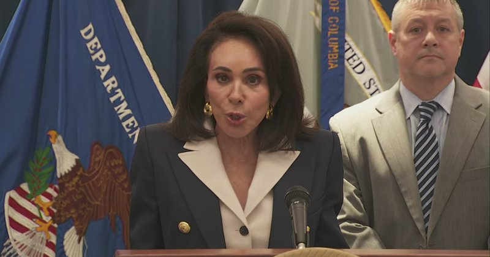

Fox News (Twitter/X)

WATCH LIVE: US Attorney Jeanine Pirro holds news conference on teen takeovers in Washington, D.C. https://twitter.com/i/broadcasts/1qJVmQqoWvYGB

## FoxNewsTwitter — post 341890

  <a href="telegram/content/FoxNewsTwitter_341890_1779131598.mp4" target="_blank">🎬 Download video</a>

Fox News (Twitter/X)

BREAKING: Evacuation orders issued as a fast-moving brush fire threatens homes near Simi Valley, California. | @AmericaRpts @johnrobertsFox @SandraSmithFox

## FoxNewsTwitter — post 341889

  <a href="telegram/content/FoxNewsTwitter_341889_1779131600.mp4" target="_blank">🎬 Download video</a>

Fox News (Twitter/X)

NEW: Vice President Vance says the best way to protect America's spirit of generosity is to lock fraudsters up behind bars.

"One of the things I love about our country is that we're a generous people. We look after one another."

"But that American generosity of spirit depends on having leaders who take care of those kids and who protect your money."

"Now we have leaders who promote you, who fight for you, who fight for your tax dollars, and fight for the kids who need those programs. And ladies and gentlemen, the only way to do that is to send the fraudsters to prison."

## FoxNewsTwitter — post 341888

  

Fox News (Twitter/X)

NEW: Austin police arrested three juveniles connected to a string of shootings across the city that injured four people, struck two fire stations, and triggered a shelter-in-place order in South Austin.

Police say a 15-year-old and 17-year-old were taken into custody Sunday after at least 12 shooting incidents overnight. A third suspect was later detained following a vehicle pursuit.

## FoxNewsTwitter — post 341887

Fox News (Twitter/X)

WATCH LIVE: VP Vance speaks at manufacturing plant in Missouri https://twitter.com/i/broadcasts/1pJdRbpzgpgKW

## FoxNewsTwitter — post 341886

Fox News (Twitter/X)

BREAKING: An American missionary has tested positive for Ebola.

U.S. missionary organization Serge says one of its medical missionaries in the Democratic Republic of Congo, Dr. Peter Stafford, has tested positive for the Bundibugyo strain of Ebola after treating patients at a hospital.

Serge says two other missionaries who treated patients in the region, including Stafford’s wife, remain asymptomatic and are following quarantine protocols as officials respond to a growing Ebola outbreak in the region.

## FoxNewsTwitter — post 341885

  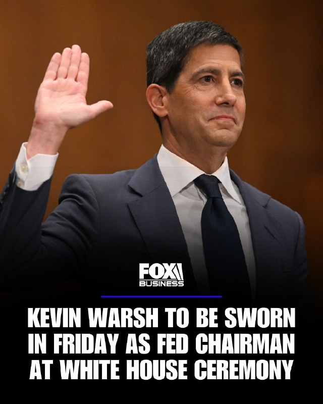

Fox News (Twitter/X)

RT @FoxBusiness: FOX BUSINESS EXCLUSIVE: Kevin Warsh will be sworn in Friday as the next chairman of the Federal Reserve during a White House ceremony hosted by President Trump, officially concluding a selection process that began in the summer of 2025.

Warsh assumes the role following last week’s Senate confirmation, which passed largely along party lines. He succeeds Jerome Powell, whose term as Fed chair expired Friday.

## FoxNewsTwitter — post 341884

  <a href="telegram/content/FoxNewsTwitter_341884_1779131602.mp4" target="_blank">🎬 Download video</a>

Fox News (Twitter/X)

Internet culture meets the Catholic Church:

Pope Leo jumps into the viral “67” TikTok trend after kids show him how it’s done.

## FoxNewsTwitter — post 341883

‌Fox News (Twitter/X)

BREAKING: Jury unanimously finds OpenAI not liable in Elon Musk lawsuit that alleged breach of charitable mission, saying statute of limitations bars the claims

## FoxNewsTwitter — post 341882

  <a href="telegram/content/FoxNewsTwitter_341882_1779131604.mp4" target="_blank">🎬 Download video</a>

Fox News (Twitter/X)

NEW: Alex Murdaugh's legal team reveals they’ve received new information about the disgraced South Carolina lawyer’s murder case since trial ended.

"We have received a number of pieces of information post-trial. Some of them came just to us."

"Once the trial was over, we don't have the power to subpoena. We don't have the power to really investigate it all." – Dick Harpootlian, Murdaugh's lead defense

## FoxNewsTwitter — post 341881

  <a href="telegram/content/FoxNewsTwitter_341881_1779131606.mp4" target="_blank">🎬 Download video</a>

Fox News (Twitter/X)

BREAKING: Alex Murdaugh’s legal team announces a federal civil rights lawsuit against former court clerk Becky Hill for jury tampering.

The lawsuit argues that Hill's actions during Murdaugh’s trial, which eventually led to the disgraced lawyer’s murder charges being overturned by the South Carolina Supreme Court, completely violated Murdaugh's right to a fair trial.

“It has been a judged as a matter of state law that she deprived Alex of his constitutional rights, deprived him of a right to a fair trial, and as a result.”

## pm_afshaa — post 90981

  <a href="telegram/content/pm_afshaa_90981_1779131607.webm" target="_blank">🎬 Download video</a>

اومدم یه چنل سیگنال‌دهی رو معرفی کنم که اکثرتون هم میشناسیدش
😎 
❗️این برآیندی که میبینید فقط برای یک هفته کانالشه ! میدونی 1256% سود یعنی چی؟ اگه توی هر سیگنال ده درصد سرمایت هم وارد میشدی ، الان سرمایت بیشتر از دوبرابر شده بود
🥃 (اینم بگم که همه سیگنال ها…

## pm_afshaa — post 90980

  <a href="telegram/content/pm_afshaa_90980_1779131608.webm" target="_blank">🎬 Download video</a>

اومدم یه چنل سیگنال‌دهی رو معرفی کنم که اکثرتون هم میشناسیدش
😎

❗️این برآیندی که میبینید فقط برای یک هفته کانالشه !

میدونی 1256% سود یعنی چی؟
اگه توی هر سیگنال ده درصد سرمایت هم وارد میشدی ، الان سرمایت بیشتر از دوبرابر شده بود
🥃
(اینم بگم که همه سیگنال ها با اهرم 15 الی 20 ارسال میشه و دارای نقاط هستش
✅)

وین ریت 95% کجا میتونید پیدا کنید خدایی؟
😎

در کنار سیگنال های مطمعن؛

➕ صفر تا صد اموزش تحلیل بازار با بهترین استراتژی های دنیا (ict+smt)

➕ باز کردن پوزیشن و کار با صرافی رو بهتون اموزش میدن

➕حرفه ای ترین تحلیل دلار و طلا و انواع ارز هارو براتون روزانه میزاره

یعنی هم ماهی بهت میدن هم ماهیگیری یادت میدن
🔥

رک بگم تو این مملکت که دلار 180 هزار تومنه اگه درآمدت دلاری نباشه زیر فشار اقتصاد دووم نمیاری!

## pm_afshaa — post 90979

  <a href="telegram/content/pm_afshaa_90979_1779131608.webm" target="_blank">🎬 Download video</a>

🔴تسنیم به نقل از یک منبع نزدیک به تیم مذاکره‌کننده: آمریکا در متن جدید خودش پذیرفته که تحریم‌های نفتی ایران رو در طول دوره مذاکرات به‌صورت موقت تعلیق (Waive) کنه. طبق این گزارش، جمهوری اسلامی همچنان بر لغو کامل همه تحریم‌ها تاکید داره، اما آمریکا فعلا فقط…

## pm_afshaa — post 90978

  <a href="telegram/content/pm_afshaa_90978_1779131608.webm" target="_blank">🎬 Download video</a>

🔴تیتر نیویورک پست:
ایالات متحده در آستانه از سرگیری نبرد با ایران با تمام توان است!

💧 Rainbet.com the #1 Non-KYC Crypto Casino & Sportsbook @rainbetcom

😁 @Pm_Afshaa

## pm_afshaa — post 90977

  <a href="telegram/content/pm_afshaa_90977_1779131609.webm" target="_blank">🎬 Download video</a>

🔴ترامپ به العربیه: ما در حال انجام کاری بزرگ هستیم و پیروزی در راهه.

💧 Rainbet.com the #1 Non-KYC Crypto Casino & Sportsbook @rainbetcom

😁 @Pm_Afshaa

## pm_afshaa — post 90976

  <a href="telegram/content/pm_afshaa_90976_1779131609.webm" target="_blank">🎬 Download video</a>

🔴ترامپ به نیویورک پست: ایران میدونه که به‌زودی چه اتفاقی براش میوفته.

💧 Rainbet.com the #1 Non-KYC Crypto Casino & Sportsbook @rainbetcom

😁 @Pm_Afshaa

## pm_afshaa — post 90975

🔴ترامپ به نیویورک پست: حاضر نیستم هیچ امتیازی به ایران واسه توافق بدم.

جمهوری اسلامی بیش از هر زمان دیگه‌ای خواهان توافقه؛ این یک مذاکره‌ست و نمی‌خوام اقدام احمقانه‌ای انجام بدم.

💧 Rainbet.com the #1 Non-KYC Crypto Casino & Sportsbook @rainbetcom

😁 @Pm_Afshaa

## pm_afshaa — post 90974

🔴یه مقام اسرائیلی امشب به i24NEWS گفت:سطح آماده‌باش واسه احتمال از سرگیری جنگ تا آخر همین هفته، فوق‌العاده بالاست

💧 Rainbet.com the #1 Non-KYC Crypto Casino & Sportsbook @rainbetcom

😁 @Pm_Afshaa

## pm_afshaa — post 90973

🔴آکسیوس: بمب‌ها مذاکره خواهند کرد

💧 Rainbet.com the #1 Non-KYC Crypto Casino & Sportsbook @rainbetcom

😁 @Pm_Afshaa

## pm_afshaa — post 90970

🔴وزیر خزانه داری آمریکا: مجوز موقت 30 روزه برای خرید نفت روسیه صادر شد

💧 Rainbet.com the #1 Non-KYC Crypto Casino & Sportsbook @rainbetcom

😁 @Pm_Afshaa

## DEJradio — post 4710

  <a href="telegram/content/DEJradio_4710_1779131610.webm" target="_blank">🎬 Download video</a>

⭕️
🚨 دونالد ترامپ رئیس جمهوری ایالات متحده در پیامی در شبکه اجتماعی تروث سوشیال نوشت:

امیر قطر، تمیم بن حمد آل ثانی، ولیعهد عربستان سعودی، محمد بن سلمان آل سعود، و رئیس‌ جمهوری امارات متحده عربی، محمد بن زاید آل نهیان، از من درخواست کرده‌اند حمله نظامی برنامه‌ریزی‌شده ما علیه جمهوری اسلامی ایران را که قرار بود فردا انجام شود، متوقف کنم؛ زیرا اکنون مذاکراتی جدی در جریان است و آنان، به‌عنوان رهبران بزرگ و متحدان ما، معتقدند توافقی حاصل خواهد شد که برای ایالات متحده آمریکا، تمامی کشورهای خاورمیانه و فراتر از آن، بسیار قابل قبول خواهد بود. این توافق، مهم‌تر از همه، شامل این خواهد بود که ایران هیچ سلاح هسته‌ای نداشته باشد.
بر پایه احترامی که برای رهبران یادشده قائلم، به وزیر جنگ، پیت هگست، رئیس ستاد مشترک نیروهای مسلح، ژنرال دنیل کین، و ارتش ایالات متحده دستور داده‌ام که حمله برنامه‌ریزی‌شده علیه ایران در فردا انجام نشود. اما در عین حال، به آنان دستور داده‌ام که در صورت نرسیدن به توافقی قابل قبول، برای اجرای یک حمله کامل و گسترده علیه ایران، در هر لحظه آماده باشند.

از توجه شما به این موضوع سپاسگزارم.
رئیس‌جمهوری، دونالد جی. ترامپ

#ترامپ #جمهوری_اسلامی
@DEJradio

## mamlekate — post 103555

📝 اعتراف پزشکیان به فروپاشی زیرساخت‌های انرژی و بن‌بست اقتصادی: گفت‌وگو نکنیم، چه کنیم؟

مسعود پزشکیان، رییس دولت جمهوری اسلامی، با اذعان به آسیب گسترده به زیرساخت های انرژی، کاهش تولید و کسری روزانه ۵۰ میلیون لیتر بنزین، دشواری صادرات نفت و گرانی پیش رو، روایت رسمی درباره بی اثر بودن حملات را زیر سوال برد و به مخالفان مذاکره گفت: «اگر گفت وگو نکنیم، چه کار کنیم؟»

@mamlekate

## VahidOnline — post 75545

  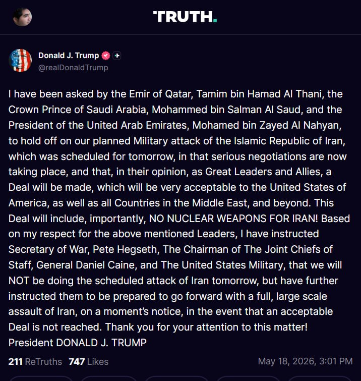

☄️ ترامپ: حمله فردا را به تعویق انداختم

پست ترامپ ترجمه ماشین:
از سوی امیر قطر تمیم بن حمد آل ثانی، ولیعهد عربستان سعودی محمد بن سلمان آل سعود و رئیس امارات متحده عربی محمد بن زاید آل نهیان، از من خواسته شده است حمله نظامی برنامه‌ریزی‌شده ما علیه جمهوری اسلامی ایران را که قرار بود فردا انجام شود، به تعویق بیندازم؛ زیرا مذاکرات جدی اکنون در جریان است و
به باور آن‌ها، به‌عنوان رهبران بزرگ و متحدان ما، توافقی حاصل خواهد شد که برای ایالات متحده آمریکا و همچنین همه کشورهای خاورمیانه و فراتر از آن بسیار قابل قبول خواهد بود.

این توافق، نکته مهمی را در بر خواهد داشت: هیچ سلاح هسته‌ای برای ایران!

بر اساس احترامی که برای رهبران نام‌برده قائلم، به وزیر جنگ، پیت هگست، رئیس ستاد مشترک ارتش، ژنرال دانیل کین، و ارتش ایالات متحده دستور داده‌ام که حمله برنامه‌ریزی‌شده فردا به ایران را انجام ندهیم؛ اما همچنین به آن‌ها دستور داده‌ام که آماده باشند، در صورت حاصل نشدن یک توافق قابل قبول، در یک لحظه و بدون درنگ، حمله‌ای کامل و گسترده علیه ایران را آغاز کنند.

از توجه شما به این موضوع سپاسگزارم!

رئیس‌جمهور دونالد جی. ترامپ
realDonaldTrump

📡 @VahidOnline

## VahidOnline — post 75544

  

دونالد ترامپ، رئیس جمهوری آمریکا، روز دوشنبه در گفتگو با نیویورک پست اعلام کرد که پس از دریافت آخرین پاسخ ناامیدکننده تهران در مذاکرات توافق صلح، «به هیچ وجه حاضر به دادن امتیاز» به ایران نیست.
ترامپ در مصاحبه تلفنی کوتاه، ضمن ابراز نارضایتی از آخرین پیشنهاد تهران گفت ایران می‌داند «به‌زودی چه اتفاقی خواهد افتاد».
به گزارش نیویورک پست، وقتی از ترامپ درباره اظهارنظر روز جمعه‌اش مبنی بر اینکه مایل به پذیرش تعلیق ۲۰ ساله غنی‌سازی اورانیوم ایران است سوال شد، جواب داد: «در حال حاضر به هیچ وجه آماده دادن امتیاز نیستم».
ترامپ ادامه داد: «من واقعا نمی‌توانم در این مورد با شما صحبت کنم. چیزهای بسیار زیادی در حال رخ دادن است».
رئیس جمهوری آمریکا همچنین گفت از تهران «ناامید یا کلافه» نشده، اما هم‌زمان تأکید کرد ایران به‌خوبی آگاه است که ایالات متحده می‌تواند فشار بیشتری وارد کند.
ترامپ گفت: «می‌توانم به شما بگویم آن‌ها بیش از هر زمان دیگری خواستار توافق هستند، زیرا آن‌ها می‌دانند ما...به‌زودی چه اتفاقی قرار است بیفتد».
وقتی درباره ادعاهای منابع منطقه‌ای مبنی بر اینکه ایران تلاش می‌کند در قبال هر دو مسئله هسته‌ای و بازگشایی تنگه هرمز در برابر واشنگتن «سیاست صبر و انتظار» پیش بگیرد، سوال شد، ترامپ گفت «چنین چیزی نشنیده است».
@VahidOOnLine

📡 @VahidOnline

## VahidOnline — post 75543

  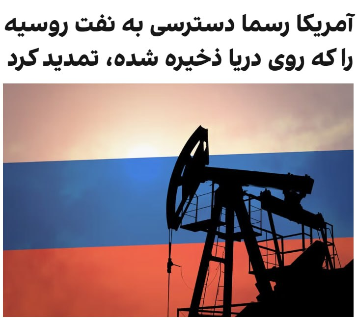

اسکات بسنت، وزیر خزانه‌داری ایالات متحده، دوشنبه گفت که آمریکا در حال صدور یک مجوز عمومی ۳۰ روزه برای فراهم کردن دسترسی موقت به آن بخش از نفت روسیه‌ است که در دریا سرگردان مانده است.
بسنت در شبکه ایکس نوشت: «این تمدید، انعطاف‌پذیری بیشتری فراهم خواهد کرد و ما با این کشورها همکاری خواهیم کرد تا در صورت نیاز، مجوزهای مشخص صادر کنیم.»
او افزود: «این مجوز عمومی به ثبات بازار فیزیکی نفت خام کمک خواهد کرد و اطمینان می‌دهد که نفت به آسیب‌پذیرترین کشورهای از نظر انرژی برسد.»
@VahidOOnLine

📡 @VahidOnline

## kianmeli1 — post 87467

  

🔴بازی تکراری و پر از فریب ترامپ

هر زمان قیمت نفت از ۱۰۰ دلار عبور میکند٫ میگوید توافق نزدیک است
امشب نیز قیمت نفت ۱۱۲ دلار بود

دوباره با حربه ی مذاکره قیمت را پایین می آورد
https://t.me/kianmeli1

## kianmeli1 — post 87466

🔴ترامپ:

امیر قطر، تمیم بن حمد آل ثانی، ولیعهد عربستان سعودی، محمد بن سلمان آل سعود، و رئیس جمهور امارات متحده عربی، محمد بن زاید آل نهیان، از من خواسته‌اند که حمله نظامی برنامه‌ریزی شده‌مان به جمهوری اسلامی ایران را که قرار بود فردا انجام شود، به تعویق بیندازم، چرا که مذاکرات جدی اکنون در حال انجام است و به نظر آنها، به عنوان رهبران و متحدان بزرگ، توافقی حاصل خواهد شد که برای ایالات متحده آمریکا و همچنین همه کشورهای خاورمیانه و فراتر از آن بسیار قابل قبول خواهد بود. این توافق، مهم‌تر از همه، شامل عدم دستیابی ایران به سلاح هسته‌ای خواهد بود! با توجه به احترامی که برای رهبران ذکر شده در بالا قائلم، به وزیر جنگ، پیت هگزت، رئیس ستاد مشترک ارتش، ژنرال دنیل کین، و ارتش ایالات متحده دستور داده‌ام که فردا حمله برنامه‌ریزی شده به ایران را انجام نخواهیم داد، اما به آنها دستور داده‌ام که آماده باشند تا در صورت عدم دستیابی به توافق قابل قبول، فوراً حمله‌ای کامل و گسترده به ایران انجام دهند. از توجه شما به این موضوع متشکرم! رئیس جمهور دونالد جی. ترامپ
https://t.me/kianmeli1

## IranIntlTV — post 337826

  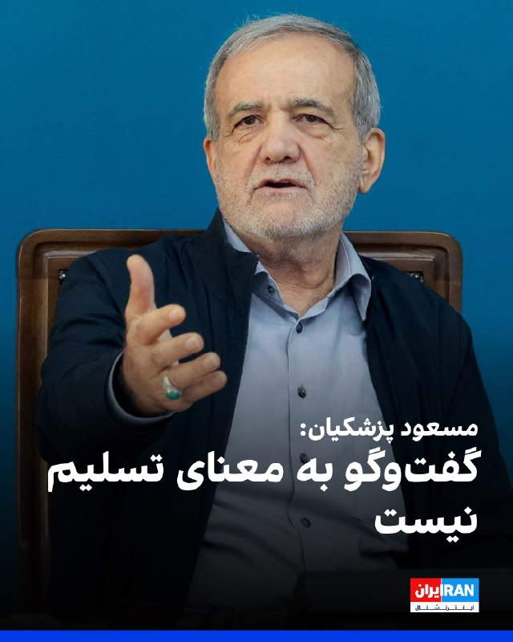

مسعود پزشکیان در شبکه ایکس نوشت: «گفت‌وگو به معنای تسلیم نیست. جمهوری اسلامی با عزت، اقتدار و حفظ حقوق ملت وارد گفت‌وگو می‌شود و به هیچ عنوان از حقوق قانونی مردم و کشور عقب‌نشینی نمی‌کند.»
او افزود: «ما با منطق و با تمام توان، تا پای جان، در خدمت مردم و حافظ منافع و عزت ایران خواهیم بود.»
https://iranintl.com/202605181966

## IranIntlTV — post 337825

  <a href="telegram/content/IranIntlTV_337825_1779131612.mp4" target="_blank">🎬 Download video</a>

۲۴ با فرداد فرحزاد
@iranintltv

## IranIntlTV — post 337824

  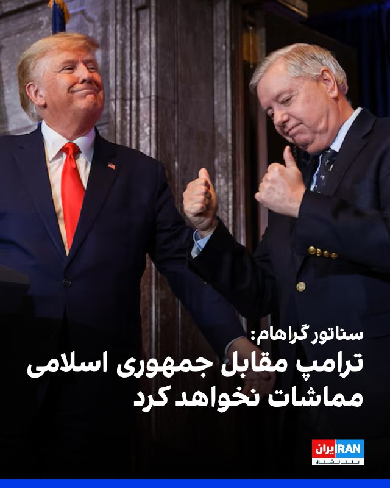

لیندسی گراهام، سناتور جمهوری‌خواه، در شبکه ایکس نوشت: «اطمینان کامل دارم که ترامپ به‌خوبی وضعیت ایران را درک می‌کند و در برابر ادامه خودداری جمهوری اسلامی از مذاکره صادقانه، همراه با اقدامات تهاجمی این کشور در تنگه هرمز و سراسر منطقه، مماشات نخواهد کرد.»

او افزود: «یک پاسخ کوتاه اما قاطع می‌تواند مسیر درگیری را به‌درستی تغییر دهد. در مواجهه با جمهوری اسلامی، ضروری است که از موضع قدرت و برتری وارد مذاکره شویم.»
https://iranintl.com/202605181005

## IranIntlTV — post 337823

  <a href="https://t.me/IranintlTV/337823" target="_blank">📎 Download file</a>

🎧نسخه صوتی تیتراول با نیوشا صارمی: احتمال آغاز جنگ در همین هفته با فرمان ترامپ پس از رد آخرین پیشنهاد تهران
@iranintlTV

## IranIntlTV — post 337822

پای فراخوان‌‌های شبانه و نمایش حکومتی سلاح در خیابان‌های ایران و صدا و سیمای جمهوری اسلامی به رسانه‌های بین‌المللی هم رسید. سی‌ان‌ان در گزارشی نوشت جمهوری اسلامی حامیانش را برای نمایش آمادگی برای جنگ بسیج می‌کند و با گذشت بیش از ده هفته از زمان شروع جنگ این تجمعات با حمایت نهادهای حکومتی و نظامی همچنان ادامه دارد.

گفت‌وگو با حسین قاضیان، جامعه‌شناس
@iranintltv

## IranIntlTV — post 337821

  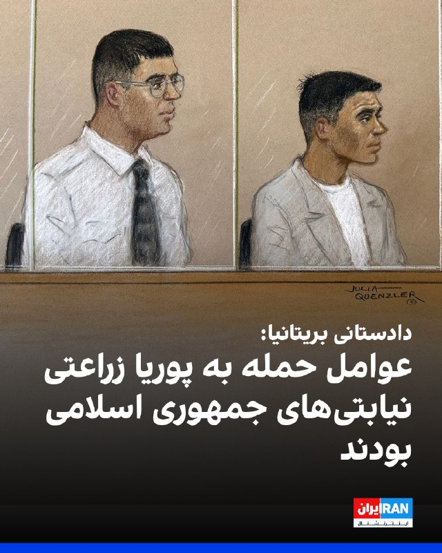

دادستان‌ها در دادگاه رسیدگی به پرونده حمله با چاقو به «پوریا زراعتی»، مجری شبکه ایران‌اینترنشنال، در لندن اعلام کردند این حمله را گروهی از اتباع رومانیایی انجام دادند که به‌عنوان نیروهای نیابتی جمهوری اسلامی عمل می‌کردند.

به گفته دادستان‌ها، این حمله را طرف سومی که به نمایندگی از حکومت ایران عمل می‌کرد، سفارش داده بود.
دادستان در جریان این جلسه که برای محاکمه دو نفر از سه متهم در دادگاه کیفری، برگزار شد، این حادثه را «عملی خشونت‌آمیز، برنامه‌ریزی‌شده و مبتنی بر شناسایی قبلی هدف» توصیف کردند.

دادستان اتکینسون گفت: «در سال‌های اخیر، از سال ۲۰۰۵ به این سو، جمهوری اسلامی کمتر به عوامل خود اتکا کرده و بیش از پیش به استفاده از نیروهای نیابتی، از جمله باندهای جنایی، روی آورده است تا تهدیدهای خشونت‌آمیز خود را از طریق آن‌ها عملی کند.»
https://iranintl.com/202605189885

## IranIntlTV — post 337820

  <a href="telegram/content/IranIntlTV_337820_1779131614.mp4" target="_blank">🎬 Download video</a>

مهدی مهدوی‌آزاد در برنامه «چشم‌انداز» گفت برخی افراد در ساختار جمهوری اسلامی، با وجود آن‌که ازسرگیری عملیات نظامی را قریب‌الوقوع و اجتناب‌ناپذیر می‌دانند، با طرح درخواست قتل بنیامین نتانیاهو و دونالد ترامپ به آتش جنگ دامن می‌زنند و زیرساخت‌های ایران را در معرض خطر قرار می‌دهند.
@iranintltv

## IranIntlTV — post 337819

چند ساعت بعد از این‌که تهران اعلام کرد به پیشنهاد آخر واشینگتن پاسخ داده، یک مقام ارشد آمریکایی به آکسیوس گفت پاسخ جمهوری اسلامی ناکافی بوده و احتمال از سرگیری جنگ را بیش از پیش می‌کند. پنتاگون گزینه‌های نظامی علیه جمهوری اسلامی را آماده و به دونالد ترامپ ارائه کرده. براساس گزارش‌ها ده‌‌ها هوایپمای حامل مهمات و تجهیزات نظامی ایالات متحده به اسرائیل منتقل شدن. نیویورک‌تایمز اقدامات آمریکا و اسرائیل را بزرگ‌ترین آماده‌سازی از زمان آتش‌بس توصیف کرده و نوشته دو کشور برای ازسرگیری احتمالی حملات به ایران، حتی در همین هفته آماده می‌شوند.

گفت‌وگو با سمیرا قرائی و بابک اسحاقی، خبرنگاران ایران‌اینترنشنال

@iranintltv

## IranIntlTV — post 337818

  

دونالد ترامپ در گفت‌وگویی کوتاه با نیویورک پست اعلام کرد که پس از دریافت پاسخ اخیر جمهوری اسلامی درباره مذاکرات، «هیچ تمایلی» به دادن هیچ‌گونه امتیاز به تهران ندارد.
او همچنین هشدار داد جمهوری اسلامی می‌داند «به‌زودی چه اتفاقی خواهد افتاد»، بدون آنکه جزئیات بیشتری ارائه کند.

ترامپ در پاسخ به پرسشی درباره اظهارنظرش درباره آمادگی برای پذیرش توقف ۲۰ ساله غنی‌سازی اورانیوم جمهوری اسلامی گفت: در حال حاضرآماده دادن هیچ امتیازی نیستم. واقعا نمی‌توانم درباره این موضوع صحبت کنم. اتفاقات زیادی در حال رخ دادن است.

ترامپ افزود که از تهران «عصبانی یا ناراحت» نیست، اما تاکید کرد جمهوری اسلامی به‌خوبی می‌داند آمریکا توان وارد کردن فشار و خسارت بیشتر را دارد. می‌توانم بگویم آن‌ها بیش از هر زمان دیگری خواهان توافق هستند، چون می‌دانند به‌زودی چه اتفاقی در راه است.

ترامپ: این یک مذاکره است و نمی‌خواهم اقدام احمقانه‌ای انجام دهم.
https://iranintl.com/202605186094

## Shin_Persian — post 6072

  

Shin ✓ @hey_itsmyturn Mon, 18 May 2026 19:06:13 UTC President Trump @POTUS: "I have been asked by the Emir of Qatar, Tamim bin Hamad Al Thani, the Crown Prince of Saudi Arabia, Mohammed bin Salman Al Saud, and the President of the United Arab Emirates, Mohamed…

## Shin_Persian — post 6071

Shin ✓ @hey_itsmyturn
Mon, 18 May 2026 19:06:13 UTC

President Trump @POTUS:
"I have been asked by the Emir of Qatar, Tamim bin Hamad Al Thani, the Crown Prince of Saudi Arabia, Mohammed bin Salman Al Saud, and the President of the United Arab Emirates, Mohamed bin Zayed Al Nahyan, to hold off on our planned Military attack of the Islamic Republic of Iran, which was scheduled for tomorrow, in that serious negotiations are now taking place, and that, in their opinion, as Great Leaders and Allies, a Deal will be made, which will be very acceptable to the United States of America, as well as all Countries in the Middle East, and beyond. This Deal will include, importantly, NO NUCLEAR WEAPONS FOR IRAN! Based on my respect for the above mentioned Leaders, I have instructed Secretary of War, Pete Hegseth, The Chairman of The Joint Chiefs of Staff, General Daniel Caine, and The United States Military, that we will NOT be doing the scheduled attack of Iran tomorrow, but have further instructed them to be prepared to go forward with a full, large scale assault of Iran, on a moment’s notice, in the event that an acceptable Deal is not reached. Thank you for your attention to this matter! President DONALD J. TRUMP"

فارسی

رئیس‌جمهور ترامپ @POTUS:
«از سوی شیخ تمیم بن حمد آل ثانی امیر قطر، محمد بن سلمان آل سعود ولیعهد عربستان سعودی و محمد بن زاید آل نهیان رئیس امارات متحده عربی از من خواسته شده است که از حمله نظامی برنامه‌ریزی شده‌مان به جمهوری اسلامی ایران که برای فردا برنامه‌ریزی شده بود، صرف‌نظر کنم؛ چرا که مذاکرات جدی در حال انجام است و به عقیده آن‌ها، به عنوان رهبرانی بزرگ و متحد، توافقی حاصل خواهد شد که برای ایالات متحده آمریکا و همچنین تمامی کشورهای خاورمیانه و فراتر از آن بسیار قابل قبول خواهد بود. این توافق، به طور مهمی، شامل عدم دستیابی ایران به سلاح هسته‌ای خواهد بود! بر اساس احترامی که برای رهبران مذکور قائل هستم، به وزیر جنگ، پیت هگست، رئیس ستاد مشترک ارتش، ژنرال دنیل کین و ارتش ایالات متحده دستور داده‌ام که حمله برنامه‌ریزی شده فردا به ایران را انجام ندهند، اما علاوه بر آن به آن‌ها دستور داده‌ام تا آماده باشند که در صورت عدم دستیابی به توافقی قابل قبول، در لحظه، یک حمله تمام‌عیار و گسترده علیه ایران را به پیش ببرند. از توجه شما به این موضوع سپاسگزارم! رئیس‌جمهور دونالد جی. ترامپ»

𝕏 · @shin_persian

## Shin_Persian — post 6070

  

Shin ✓ @hey_itsmyturn Mon, 18 May 2026 19:06:09 UTC President Trump @POTUS: "I have been asked by the Emir of Qatar, Tamim bin Hamad Al Thani, the Crown Prince of Saudi Arabia, Mohammed bin Salman Al Saud, and the President of the United Arab Emirates, Mohamed…

## Shin_Persian — post 6069

Shin ✓ @hey_itsmyturn
Mon, 18 May 2026 19:06:09 UTC

President Trump @POTUS:
"I have been asked by the Emir of Qatar, Tamim bin Hamad Al Thani, the Crown Prince of Saudi Arabia, Mohammed bin Salman Al Saud, and the President of the United Arab Emirates, Mohamed bin Zayed Al Nahyan, to hold off on our planned Military attack of the Islamic Republic of Iran, which was scheduled for tomorrow, in that serious negotiations are now taking place, and that, in their opinion, as Great Leaders and Allies, a Deal will be made, which will be very acceptable to the United States of America, as well as all Countries in the Middle East, and beyond. This Deal will include, importantly, NO NUCLEAR WEAPONS FOR IRAN! Based on my respect for the above mentioned Leaders, I have instructed Secretary of War, Pete Hegseth, The Chairman of The Joint Chiefs of Staff, General Daniel Caine, and The United States Military, that we will NOT be doing the scheduled attack of Iran tomorrow, but have further instructed them to be prepared to go forward with a full, large scale assault of Iran, on a moment’s notice, in the event that an acceptable Deal is not reached. Thank you for your attention to this matter! President DONALD J. TRUMP"

فارسی

رئیس‌جمهور ترامپ @POTUS:

«از من توسط تمیم بن حمد آل ثانی، امیر قطر، محمد بن سلمان آل سعود، ولیعهد عربستان سعودی، و محمد بن زاید آل نهیان، رئیس امارات متحده عربی، درخواست شده است تا حمله نظامی برنامه‌ریزی‌شده‌مان علیه جمهوری اسلامی ایران را که برای فردا برنامه‌ریزی شده بود، متوقف کنم؛ چرا که اکنون مذاکرات جدی در حال انجام است و به عقیده آن‌ها، به عنوان رهبرانی بزرگ و متحد، توافقی حاصل خواهد شد که برای ایالات متحده آمریکا و همچنین تمامی کشورهای خاورمیانه و فراتر از آن، بسیار قابل قبول خواهد بود. این توافق، به طور مهمی، شامل عدم دستیابی ایران به سلاح هسته‌ای خواهد بود! بر اساس احترامی که برای رهبران مذکور قائل هستم، به پیت هگست، وزیر جنگ، ژنرال دنیل کین، رئیس ستاد مشترک ارتش، و ارتش ایالات متحده دستور داده‌ام که حمله برنامه‌ریزی‌شده فردا به ایران را انجام نخواهیم داد، اما همچنین به آن‌ها دستور داده‌ام که آماده باشند تا در صورت عدم دستیابی به یک توافق قابل قبول، در لحظه، یک حمله تمام‌عیار و گسترده علیه ایران را به پیش ببرند. از توجه شما به این موضوع سپاسگزارم! رئیس‌جمهور دونالد جی. ترامپ»

𝕏 · @shin_persian

## Shin_Persian — post 6067

  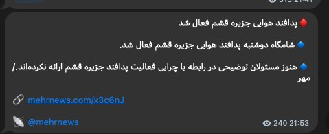

Shin ✓ @hey_itsmyturn
Mon, 18 May 2026 18:57:46 UTC

Staten-owned MehrNews:
Air Defense activity in Qeshm island, Hormozgan Province, #Iran

فارسی

خبرگزاری دولتی مهر:
فعالیت پدافند هوایی در جزیره قشم، استان هرمزگان، #Iran_

𝕏 · @shin_persian

## Shin_Persian — post 6066

Shin ✓ @hey_itsmyturn
Mon, 18 May 2026 18:03:50 UTC

Something might be cooking, and I hope it’s a batch of Kotlets.

فارسی

ممکن است خبری در راه باشد، و امیدوارم که یک دوجین کتلت باشد.

𝕏 · @shin_persian

## ManotoTV — post 105608

  <a href="telegram/content/ManotoTV_105608_1779131618.mp4" target="_blank">🎬 Download video</a>

تماسی از ایران:
از سیروان شعبانی، ۲۲ ساله از اسلامشهر گفت…
استاد موسیقی که نوزدهم دی بازداشت شد و حالا در اوین است

## ManotoTV — post 105607

  <a href="telegram/content/ManotoTV_105607_1779131619.mp4" target="_blank">🎬 Download video</a>

دونالد ترامپ، رئیس‌جمهوری آمریکا، در گفت‌وگو با نیویورک پست اعلام کرد پس از دریافت تازه‌ترین پاسخ «ناامیدکننده» جمهوری اسلامی در مذاکرات مربوط به توافق صلح، «برای هیچ‌گونه امتیازدهی به تهران آمادگی ندارد.»

ترامپ همچنین در اظهاراتی هشدارآمیز گفت جمهوری اسلامی می‌داند «به‌زودی چه اتفاقی قرار است بیفتد.»

او در این گفت‌وگوی کوتاه تلفنی، به نظر می‌رسید پیشنهاد جمهوری اسلامی برای ادامه مذاکرات دیپلماتیک، که روز یکشنبه مطرح شده بود، را رد کرده است.

ترامپ در پاسخ به سوالی درباره اظهارات روز جمعه‌اش مبنی بر آمادگی برای پذیرش توقف ۲۰ ساله غنی‌سازی اورانیوم در ایران گفت: «در حال حاضر برای هیچ چیزی آمادگی ندارم.»

رئیس‌جمهوری آمریکا از ارائه جزئیات بیشتر خودداری کرد و گفت: «واقعاً نمی‌توانم درباره‌اش صحبت کنم. اتفاقات زیادی در حال رخ دادن است.»

بر اساس این گزارش، ترامپ پس از بازگشت از سفرش به چین، آخر هفته را در باشگاه گلف خود در ویرجینیا همراه با تیم امنیت ملی آمریکا به بررسی گام‌های بعدی درباره جمهوری اسلامی گذرانده است.

نیویورک پست نوشت انتظار می‌رود نشست‌های بیشتری روز سه‌شنبه برگزار شود؛ در حالی که برخی متحدان تندرو ترامپ، از جمله لیندسی گراهام، سناتور جمهوری‌خواه، از او خواسته‌اند با متوقف شدن روند دیپلماسی، عملیات نظامی علیه جمهوری اسلامی را از سر بگیرد.

ترامپ همچنین گفت از تهران «ناامید» نشده، اما تاکید کرد جمهوری اسلامی به‌خوبی می‌داند آمریکا توان وارد کردن «فشار و آسیب بیشتر» را دارد.

او گفت: «می‌توانم بگویم آن‌ها بیشتر از هر زمان دیگری می‌خواهند توافق کنند، چون می‌دانند ما… چه اتفاقی قرار است به‌زودی بیفتد.»

ترامپ در پاسخ به سوالی درباره گزارش‌هایی مبنی بر تلاش جمهوری اسلامی برای «وقت‌کشی» در موضوع هسته‌ای و بازگشایی تنگه هرمز گفت چنین چیزی نشنیده است.

او افزود: «چیزی نمی‌شنوم. نمی‌توانم درباره‌اش با شما صحبت کنم.»

ترامپ در پایان گفت: «این یک مذاکره است. نمی‌خواهم احمق باشم.»

## ManotoTV — post 105606

  <a href="telegram/content/ManotoTV_105606_1779131620.mp4" target="_blank">🎬 Download video</a>

تماسی از ایران:
« از جاویدنام علی اباذری می‌گفت…
با گذشت ماه‌ها، درد هنوز تازه‌ست؛ انگار همین دیروز اتفاق افتاده.»

## ManotoTV — post 105605

  <a href="telegram/content/ManotoTV_105605_1779131621.mp4" target="_blank">🎬 Download video</a>

ایرانیان مقیم مادرید امروز دوشنبه ۱۸ می، مقابل سفارت نروژ در پایتخت اسپانیا تجمع کردند. این تجمع در اعتراض به دیدار برخی سیاستمداران نروژی با مقام‌های جمهوری اسلامی و در حمایت از شاهزاده رضا پهلوی برگزار شد.

معترضان خواستار پایان دادن به مماشات با جمهوری اسلامی و شنیده شدن صدای مردم ایران شدند.

## ManotoTV — post 105604

  <a href="telegram/content/ManotoTV_105604_1779131622.mp4" target="_blank">🎬 Download video</a>

‌
داده‌های ردیابی پروازها نشان می‌دهد انتقال هوایی تجهیزات و نیروهای نظامی آمریکا به خاورمیانه همچنان ادامه دارد.

بر اساس گزارش الجزیره از داده‌های پروازی، دست‌کم ۲۶ پرواز نظامی آمریکا بین ۱۵ تا ۱۷ مه از آلمان به مقصد خاورمیانه انجام شده است.

این گزارش می‌گوید این جابه‌جایی‌ها همزمان با افزایش حضور نظامی آمریکا در اطراف تنگه هرمز، دریای عمان و دریای عرب انجام شده است.

بر اساس داده‌های ردیابی، تمام پروازهای ثبت‌شده با هواپیماهای نظامی «بوئینگ سی-۱۷ اِی گلوب‌مستر ۳» انجام شده‌اند؛ هواپیماهای ترابری سنگینی که نیروی هوایی آمریکا از آن‌ها برای انتقال نیرو و تجهیزات نظامی استفاده می‌کند.

## ManotoTV — post 105603

  <a href="telegram/content/ManotoTV_105603_1779131623.mp4" target="_blank">🎬 Download video</a>

‌
وزارت خزانه‌داری آمریکا اعلام کرد مجوزی عمومی و موقت ۳۰ روزه صادر کرده تا «آسیب‌پذیرترین کشورها» بتوانند به‌طور موقت به نفت روسیه‌ای که در دریا سرگردان مانده، دسترسی پیدا کنند.

وزارت خزانه‌داری آمریکا گفت این تمدید «انعطاف‌پذیری بیشتری» فراهم می‌کند و واشینگتن در صورت نیاز، مجوزهای مشخص‌تری نیز برای این کشورها صادر خواهد کرد.

در این بیانیه آمده است این مجوز عمومی به «ثبات بازار فیزیکی نفت خام» کمک می‌کند و تضمین می‌کند نفت به کشورهایی برسد که بیشترین آسیب‌پذیری را در حوزه انرژی دارند.

وزارت خزانه‌داری آمریکا همچنین اعلام کرد این اقدام با کاهش توانایی چین برای انبار کردن نفت ارزان‌قیمت، به هدایت دوباره عرضه موجود به سمت کشورهای نیازمند کمک خواهد کرد.

## FarsiVOA — post 218081

  <a href="telegram/content/FarsiVOA_218081_1779131623.mp4" target="_blank">🎬 Download video</a>

فرماندهی مرکزی ایالات متحده، سنتکام، اعلام کرد اجرای محاصره دریایی آمریکا علیه بنادر ایران همچنان ادامه دارد.

به گفته سنتکام، نیروهای آمریکایی تاکنون مسیر ۸۵ کشتی تجاری را برای اطمینان از اجرای کامل این اقدام تغییر داده‌اند.

@FarsiVOA

## FarsiVOA — post 218080

🔺اختصاصی؛ مقام دولت آمریکا درباره ادعای «لغو تحریم‌های رژیم ایران در زمان مذاکرات»: نادرست است

▪️دولت ایالات متحده روز دوشنبه ۲۸ اردیبهشت گزارش منتشرشده در رسانه‌های نزدیک به حکومت ایران درباره تعلیق تحریم‌های نفتی تهران در جریان مذاکرات با آمریکا را رد کرد و آن را «نادرست» خواند.

⬇️ بیشتر بخوانید:

https://ir.voanews.com/a/white-house-official-says-iran-sanctions-continue-during-peace-negotiations/8151252.html/?nocach=1

## FarsiVOA — post 218079

  <a href="telegram/content/FarsiVOA_218079_1779131624.mp4" target="_blank">🎬 Download video</a>

گلایه یک شهروند از گرانی؛ «دیگر برنج هم نمی‌توانیم بخریم.»

در سایه بی‌ثباتی اقتصادی و فشارهای مداوم، زندگی روزمره بسیاری از مردم به میدان مبارزه‌ای خاموش برای تأمین حداقل‌ها تبدیل شده است.

## FarsiVOA — post 218078

سازمان عفو بین‌الملل در گزارش سالانه خود در مورد اجرای مجازات در سال ۲۰۲۵، اعلام کرد که در مجموع دو هزار و ۷۰۷ اعدام در سراسر جهان به ثبت رسیده که نشان دهنده افزایش یک هزار و ۵۱۸ اعدام نسبت به سال ۲۰۲۴ است. این رقم البته موارد اعدام در سه کشور چین، کره شمالی و ویتنام که آماری از آنها در دست نیست، در بر نمی‌گیرد.

بر اساس گزارش عفو بین‌الملل، در سال ۲۰۲۵ در حالی در مجموع ۱۷ کشور از مجازات اعدام استفاده کردند، جمهوری اسلامی به تنهایی دو هزار و ۱۵۹ نفر را اعدام کرده، که حدود ۸۰ درصد از آمار کلی اعدام‌ها در جهان است.

تعداد اعدام‌ها در ایران توسط جمهوری اسلامی در سال ۲۰۲۴، حدود ۹۷۲ نفر ثبت شده که افزایش آن در سال ۲۰۲۵، موجب جهش چشمگیر تعداد اعدام‌ها در سراسر جهان شده است.

زارش کامل را در وب‌سایت صدای آمریکا بخوانید.

@FarsiVOA

## DW_Farsi — post 124854

  

🔶 آمریکا: مذاکرات به سختی پیش می‌رود و شاید بمب‌ها سخن بگویند

تنش‌ها میان ایران و آمریکا روز دوشنبه همچنان بالا باقی ماند. یک مقام آمریکایی پیشنهاد متقابل اخیر ایران برای پایان دائمی جنگ را "ناکافی" توصیف کرد و گفت مذاکرات «به‌سختی پیش می‌رود». او هشدار داد اگر ایران همکاری بیشتری نشان ندهد، در صورت لزوم آمریکا "با بمب‌ها سخن خواهد گفت".

همزمان دونالد ترامپ، رئیس جمهور آمریکا به نیویورک پست گفت که پس از دریافت آخرین پاسخ ایران با هدف پایان دادن به جنگ، "هیچ امتیازی برای تهران" قائل نیست و افزود که ایران می‌داند "به زودی چه اتفاقی خواهد افتاد".

او در پاسخ به سوالی در مورد اظهارات قبلی خود مبنی بر اینکه ممکن است تعلیق ۲۰ ساله غنی‌سازی اورانیوم ایران را بپذیرد، گفت: «من در حال حاضر هیچ چیزی را نمی‌پذیرم»، و از ارائه جزئیات بیشتر خودداری کرد.

ترامپ در ادامه به نیویورک پست گفت: «واقعاً نمی‌توانم در مورد آن با شما صحبت کنم. اتفاقات زیادی در حال رخ دادن است.»

او افزود که از ایران "ناامید" نشده است، اما هشدار داد که تهران درک می‌کند که ایالات متحده قادر به افزایش فشار بیشتر است.

@dw_farsi

## DW_Farsi — post 124853

  

🔶 یوروپل اعلام کرد: شناسایی و تقاضای حذف هزااران پست مربوط به سپاه

یوروپل، آژانس اتحادیه اروپا برای همکاری در اجرای قانون که مدیریت اطلاعات جنایی و مبارزه با سازماندهی جنایت و جرائم سازمان‌یافته بین‌المللی مانند تروریسم را به عهده دارد، اعلام کرد که در یک اقدام هماهنگ علیه محتوای تروریستی در فضای آنلاین، مجموعاً ۱۴ هزار و ۲۰۰ پست مرتبط با سپاه پاسداران انقلاب اسلامی هدف قرار گرفت.

سپاه که اکنون از سوی اتحادیه اروپا به‌عنوان یک سازمان تروریستی شناخته می‌شود، متهم به استفاده از فضای مجازی برای تبلیغات، جذب نیرو و جمع‌آوری منابع مالی است.

این عملیات تحت هدایت "واحد ارجاع اینترنتی اتحادیه اروپا" وابسته به یوروپل انجام شد و بر شناسایی و مختل کردن حضور آنلاین سپاه تمرکز داشت.

اتحادیه اروپا در ۱۹ فوریه ۲۰۲۶ با صدور تصمیمی رسمی سپاه را در فهرست سازمان‌های تروریستی قرار داد؛ اقدامی که به نهادهای امنیتی اروپا اجازه می‌دهد علیه فعالیت‌های مرتبط با آن در کشورهای عضو اقدام کنند.

در این عملیات، ۱۹ کشور مشارکت داشتند: اتریش، بلژیک، بوسنی و هرزگوین، بلغارستان، جمهوری چک، دانمارک، استونی، فنلاند، فرانسه، آلمان، یونان، مجارستان، ایتالیا، هلند، پرتغال، اسپانیا، سوئد، اوکراین و آمریکا.

@dw_farsi

## DW_Farsi — post 124852

🔶 جیره‌بندی بنزین در ایران؛مسیر هموار شکل‌گیری بازار سیاه سوخت

🔺 گزارشی از النا فرهادی

واقعیت عریان صف‌های بنزین و شکل‌گیری بازار سیاه، از آغاز یک بحران ساختاری و فرسایش تاب‌آوری معیشت مردم خبر می‌دهد.

در حالی که مقام‌های جمهوری اسلامی همچنان از "مدیریت مصرف" و نبود بحران در تامین سوخت سخن می‌گویند، روایت‌های روزهای اخیر از شهرهای مختلف ایران تصویر دیگری را نشان می‌دهد؛ صف‌های طولانی مقابل پمپ‌بنزین‌ها، محدودیت‌های غیررسمی در عرضه سوخت، حذف یا کاهش سهمیه کارت‌های آزاد و شکل‌گیری بازار سیاه بنزین، به‌ویژه در استان‌های جنوبی و مرزی.

هم‌زمان، دولت نیز برای نخستین‌بار به‌صراحت از آسیب دیدن بخشی از زیرساخت‌های سوخت و انرژی در جریان جنگ اخیر آمریکا و اسرائیل علیه ایران سخن گفته است؛ جنگی که از ۲۸ فوریه آغاز شد و حتی با وجود آتش‌بس شکننده، همچنان سایه آن بر بازار انرژی ایران باقی مانده است.

در چنین فضایی، پرسش اصلی دیگر فقط قیمت بنزین نیست، بلکه این است که آیا ایران وارد مرحله‌ای از بحران ساختاری در تامین سوخت شده است؟ گفت‌وگوی دویچه وله فارسی با دالغا خاتین‌اوغلو، کارشناس حوزه نفت و انرژی.

@dw_farsi

## DW_Farsi — post 124851

  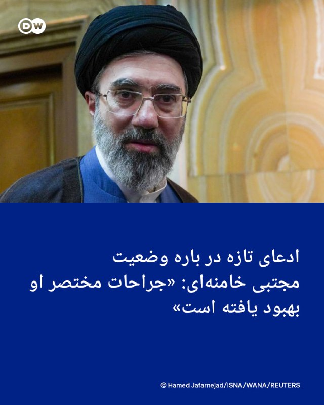

🔶 ادعای تازه در باره وضعیت مجتبی خامنه‌ای: «جراحات مختصر او بهبود یافته است»

حسین کرمان‌پور، مدیر مرکز روابط عمومی و اطلاع‌رسانی وزارت بهداشت، روز دوشنبه، ۲۸ اردیبهشت در گردهمایی روابط عمومی‌های دستگاه‌های اجرایی کشور با طرح این موضوع که مجتبی خامنه‌ای مجروح را در پی حمله آمریکا و اسرائیل به بیت پدرش به بیمارستان سینا بردند، مدعی شد که او جراحات مختصری داشته و حالا در سلامت کامل است: « خوشبختانه اتفاق خاصی برای رهبر انقلاب نیفتاده بود. فردی که در محل چنین حادثه‌ای باشد، طبیعتا چندین زخم بر روی بدن خود خواهد داشت. این زخم‌ها نیز زخم‌هایی نبود که بخواهد چهره رهبر انقلاب را مخدوش کند یا اینکه قطع عضو داشته باشند. اصلا اینگونه نیست. چند تا بخیه در محل جراحات زده شد. بخشی که همانجا تصمیم گرفته شد که بخیه زده شود روی پای ایشان بود.»

کرمان‌پور در ادامه می‌گوید که در پی انتقال مجتبی خامنه‌ای"به این فکر افتادیم که چگونه باید روایت‌سازی کنیم. همه جای دنیا در حال ساختن روایت بودند. برای ما کار خیلی سختی بود". ا و جزئیات بیشتری شرح نمی‌دهد که روایت برای چه می‌بایست تولید می‌شد و قراربود چه چیزی به مردم اطلاع داده شود یا از آنها پنهان نگه داشته شود.

حدود ده روز پیش مظاهر حسینی، مسئول دیدارهای دفتر علی خامنه‌ای، رهبر سابق جمهوری اسلامی، روایتی کمی متفاوت از وضعیت جراحات مجتبی خامنه‌ای بر اثر "موج انفجار" ارائه کرد و گفت که زمانی که مجتبی خامنه‌ای در حال بالا رفتن از پله‌ها بوده، بر اثر شلیک موشک "بین راه به زمین می‌افتد و کشکک پا و کمرش آسیب می‌بیند. کمر او در این ایام خوب شده و پا هم به زودی خوب خواهد شد".

@dw_farsi

## Persian_Trend_Official — post 14442

  <a href="telegram/content/Persian_Trend_Official_14442_1779131627.webm" target="_blank">🎬 Download video</a>

💢از سوی امیر قطر، تمیم بن حمد آل ثانی، ولیعهد عربستان سعودی، محمد بن سلمان آل سعود، و رئیس امارات متحده عربی، محمد بن زاید آل نهیان، از من خواسته شد حمله نظامی برنامه‌ریزی‌شده ما علیه جمهوری اسلامی ایران که قرار بود فردا انجام شود را متوقف کنم، زیرا مذاکرات…

## Persian_Trend_Official — post 14441

  <a href="telegram/content/Persian_Trend_Official_14441_1779131628.webm" target="_blank">🎬 Download video</a>

💢از سوی امیر قطر، تمیم بن حمد آل ثانی، ولیعهد عربستان سعودی، محمد بن سلمان آل سعود، و رئیس امارات متحده عربی، محمد بن زاید آل نهیان، از من خواسته شد حمله نظامی برنامه‌ریزی‌شده ما علیه جمهوری اسلامی ایران که قرار بود فردا انجام شود را متوقف کنم، زیرا مذاکرات…

## Persian_Trend_Official — post 14440

  

💢از سوی امیر قطر، تمیم بن حمد آل ثانی، ولیعهد عربستان سعودی، محمد بن سلمان آل سعود، و رئیس امارات متحده عربی، محمد بن زاید آل نهیان، از من خواسته شد حمله نظامی برنامه‌ریزی‌شده ما علیه جمهوری اسلامی ایران که قرار بود فردا انجام شود را متوقف کنم، زیرا مذاکرات جدی اکنون در حال انجام است و آن‌ها معتقدند به‌عنوان رهبران و متحدان بزرگ، توافقی حاصل خواهد شد که برای ایالات متحده آمریکا، همه کشورهای خاورمیانه و فراتر از آن بسیار قابل قبول خواهد بود. این توافق، مهم‌تر از همه، شامل «عدم دستیابی ایران به سلاح هسته‌ای» خواهد بود.

💢بر اساس احترامی که برای رهبران یادشده قائلم، به وزیر جنگ، پیت هگست، رئیس ستاد مشترک ارتش، ژنرال دنیل کین، و ارتش ایالات متحده دستور داده‌ام که حمله برنامه‌ریزی‌شده علیه ایران را فردا انجام ندهند، اما در عین حال به آن‌ها دستور داده‌ام در صورتی که توافق قابل قبولی حاصل نشود، آماده اجرای یک حمله کامل و گسترده علیه ایران در کوتاه‌ترین زمان ممکن باشند.

▪️از توجه شما به این موضوع سپاسگزارم!

رئیس‌جمهور دونالد جی. ترامپ

🫆:Tony

📌 @persian_trend_official
پرشین ترند | متفاوت‌ترین کانال نظامی

## Persian_Trend_Official — post 14439

🚨 ترامپ در تروث سوشال اعلام کرد که حمله برنامه‌ریزی‌شده به ایران که برای فردا در نظر گرفته شده بود را لغو کرده زیرا «مذاکرات جدی» در حال انجام است. 📝 Nick 📌 @persian_trend_official پرشین ترند | متفاوت‌ترین کانال نظامی

## Persian_Trend_Official — post 14438

🚨 ترامپ در تروث سوشال اعلام کرد که حمله برنامه‌ریزی‌شده به ایران که برای فردا در نظر گرفته شده بود را لغو کرده زیرا «مذاکرات جدی» در حال انجام است.

📝 Nick

📌 @persian_trend_official
پرشین ترند | متفاوت‌ترین کانال نظامی

## Persian_Trend_Official — post 14437

  <a href="telegram/content/Persian_Trend_Official_14437_1779131629.mp4" target="_blank">🎬 Download video</a>

💢پیت هگست وزیر جنگ آمریکا در حال تقلید مدل صحبت و صدای ترامپ

🫆:Tony

📌 @persian_trend_official
پرشین ترند | متفاوت‌ترین کانال نظامی

## Persian_Trend_Official — post 14436

  <a href="telegram/content/Persian_Trend_Official_14436_1779131630.webm" target="_blank">🎬 Download video</a>

⭕️ جمهوری اسلامی سفر بدون ویزا برای لبنانی‌ها را اعلام کرد.

سفارت جمهوری اسلامی در لبنان اعلام کرد شهروندان لبنانی دارنده گذرنامه عادی می‌توانند برای سفرهای گردشگری یا زیارتی بدون نیاز به ویزا وارد ایران شوند.

لبنانی‌ها می‌توانند هر شش ماه یک‌بار بدون ویزا به ایران سفر کنند.

مدت اقامت در این سفرها حداکثر ۱۵ روز تعیین شده است.

📝 Nick

📌 @persian_trend_official
پرشین ترند | متفاوت‌ترین کانال نظامی

## Persian_Trend_Official — post 14435

  

⭕️ علی‌حسین قاضی‌زاده:

از قشنگی‌های شبکه ایکس اینه که مدیر حکومتی که از بندبندانگشتان مدیرانش خون می‌چکه بیاد اینجا از برخورد خشن، تمامیت‌خواهی، فحاشی و استبداد گله کنه.
اون هم در شرایطی که اینترنت رو بر روی ۹۰ میلیون ایرانی بستند‌ و سر تیربار رو سمت مردم گرفتند.
اینها وقیح نیستند. لغت تازه‌ای باید در زبان فارسی برای این جماعت ساخته بشه.

📝 Nick

📌 @persian_trend_official
پرشین ترند | متفاوت‌ترین کانال نظامی

## Persian_Trend_Official — post 14434

  <a href="telegram/content/Persian_Trend_Official_14434_1779131631.mp4" target="_blank">🎬 Download video</a>

⭕️نمایش و استفاده دوباره از اسلحه در برنامه زنده صداوسیما

💢اینبار هدف گیری و شلیک به سمت تصویر دونالد ترامپ به یاد بچه های مظلوم جزیره اپستین ‼️

🫆:Tony

📌 @persian_trend_official
پرشین ترند | متفاوت‌ترین کانال نظامی

## Persian_Trend_Official — post 14432

  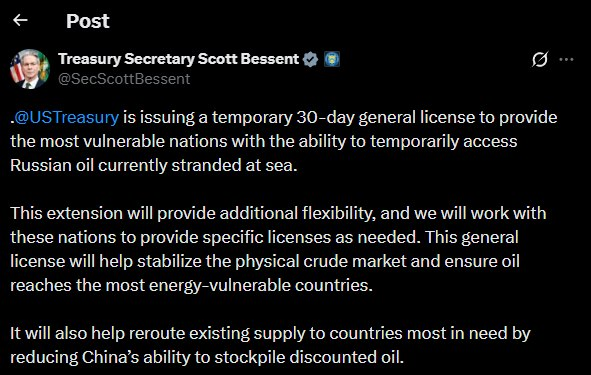

وزیر خزانه‌داری ایالات متحده، مجوزی ۳۰ روزه صادر کرد که به کشورهای آسیب‌پذیر اجازه می‌دهد نفت روسیه‌ای را که در دریا سرگردان مانده است خریداری کنند.
دولت آمریکا تاکنون حداقل ۳ بار این معافیت موقت خرید نفت روسیه را تمدید/احیا کرده است.
▪️ ۱۹ مارس ۲۰۲۶
▪️ ۲۲ آوریل ۲۰۲۶
▪️ ۱۸ مه ۲۰۲۶
تمام این تمدیدها به‌صورت دوره‌های ۳۰ روزه صادر شده‌اند.

🦁Phantom
🦁

📌 @persian_trend_official
پرشین ترند | متفاوت‌ترین کانال نظامی

## Persian_Trend_Official — post 14431

کانال رسمی پرشین ترند pinned «https://youtube.com/live/7aZKWyXxQog?feature=share»

## Persian_Trend_Official — post 14430

https://youtube.com/live/7aZKWyXxQog?feature=share

## Persian_Trend_Official — post 14429

  

📰پرزیدنت ترامپ به العربیه :
کار با عظمتی انجام می‌دهیم، و پیروزی پیش روی ماست.

🦁Phantom
🦁

✍@persian_trend_official
پرشین ترند | متفاوت‌ترین کانال نظامی

## RadioFarda — post 157320

معافیت روسیه از تحریم‌های نفتی آمریکا یک ماه دیگر تمدید شد

🔸وزیر خزانه‌داری آمریکا روز دوشنبه، ۲۸ اردیبهشت، اعلام کرد که آمریکا به مدت ۳۰ روز دیگر فروش نفت روی آبِ روسیه از تحریم‌های ایالات متحده را تمدید کرده است.

🔸این اقدام همزمان با عدم موفقیت تهران و واشینگتن در رسیدن به توافق برای پایان جنگ و ادامه افزایش قیمت سوخت در سراسر دنیا انجام می‌شود.

🔸این دومین بار است که در پی حمله مشترک آمریکا و اسرائیل به خاک ایران معافیت روسیه از فروش نفت در دنیا تمدید می‌شود.

🔸بار اول، همزمان با ادامه بسته ماندن تنگه هرمز و افزایش قیمت نفت در بازارهای جهانی، دولت آمریکا روز جمعه، ۲۸ فروردین، معافیتی را که پیشتر برای امکان موقت فروش نفت روسیه قائل شده بود، تمدید کرد.

🔸این مجوز خرید بخشی از نفت تولیدی روسیه را که پیش از اعلام معافیت، در نفتکش‌ها بارگیری شده و روی آب بودند به مدت یک ماه مجاز اعلام می‌کرد.

🔸اسکات بِسِنت، وزیر خزانه‌داری آمریکا، روز دوشنبه در پیامی در شبکه ایکس نوشت که این معافیت دوباره کمکی است به «آسیب‌پذیرترین کشورها برای دسترسی یافتن به نفت روی آبِ روسیه».

🔸از زمان آغاز جنگ ایران، قیمت جهانی نفت و به‌تبع آن قیمت سوخت در بسیاری از کشورها از جمله ایالات متحده بالا رفته است. به نوشته خبرگزاری فرانسه، در حال حاضر قیمت بنزین در آمریکا ۵۰ درصد بالاتر از قیمت این کالا در روز آغاز جنگ است.

@RadioFarda

## RadioFarda — post 157319

  

🔸دونالد ترامپ، رئیس جمهور آمریکا، روز دوشنبه در پیامی تازه در شبکه اجتماعی خود با حمله به چند رسانه جریان اصلی در این کشور آنها را به جانبداری از ایران در جنگ متهم کرد.

🔸او نوشته است: «اگر ایران تسلیم شود و اقرار کند که نیروی دریایی‌اش در قعر دریاست و نیروی هوایی‌اش دیگر وجود ندارد و کل ارتش ایران هم از تهران خارج شود و سلاح‌ها را زمین بگذارند و فریاد بزنند که تسلیم، تسلیم»، باز هم نیویورک تایمز و وال استریت جورنال و سی‌ان‌ان و باقی «رسانه‌های خبری دروغگو تیتر خواهند زد که ایران به پیروزی‌ای درخشان علیه ایالات متحده آمریکا دست یافته است.»

🔸به گفته ترامپ در این پیام، دموکرات‌ها و رسانه‌ها «کاملا دیوانه شده‌اند».

🔸بیش از یک ماه پس از برقراری آتش‌بس میان ایران و آمریکا، در حالی که دو طرف هنوز نتوانسته‌اند به توافقی برای پایان جنگ برسند، فشار بر رئیس جمهور آمریکا که با گرانی روزافزون سوخت و اجناس در کشور خود روبه‌روست و هر روز به زمان برگزاری انتخابات میان‌دوره‌ای نزدیک‌تر می‌شود افزایش یافته است.

@RadioFarda

## IranianMinds — post 20361

🔴خبرگزاری مهر:

پدافند هوایی قشم فعال شد.

@IranianMinds

## IranianMinds — post 20360

  

🔴تیتر خبرگزاری نیویورک‌پست:

ایالات متحده در آستانه از سرگیری نبرد با ایران با تمام توان است.

@IranianMinds

## IranianMinds — post 20359

🔴 ترامپ به نیویورک پست :

هیچ امتیازی برای تهران «باز نیست» و ایران می‌داند «به زودی چه اتفاقی قرار است بیفتد».

@IranianMinds

## IranianMinds — post 20358

  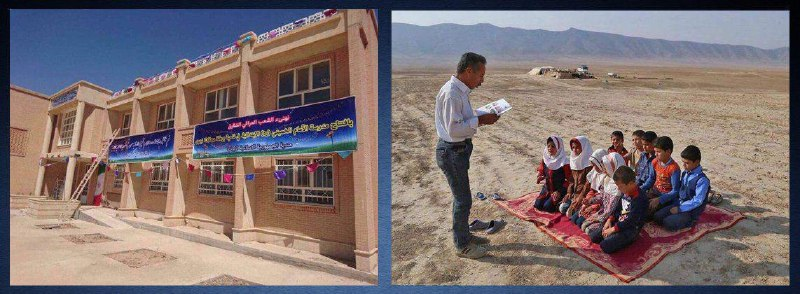

سمت چپ : مدرسه ابتدایی خمینی در موصل عراق ، هدیه جمهوری اسلامی ، سمت راست : کلاس درس بدون سقف یک مدرسه ابتدایی در ایران ...

@IranianMinds

## IranianMinds — post 20357

  

✅ (فقط ۲۰۰ هزار تومن)🥺

🌱 قیمت اقتصادی + پشتیبانی حرفه‌ای

🚀 سریع و پایدار، بدون قطعی
🦋پشتیبانی واقعی، همیشه در دسترس

ربات ما🌴
📩 @dayaconfigbot

کانال ما🌳
📩 @dayavpn

## BBCPersian — post 281391

  

🔻دادگاهی در کالیفرنیا شکایت ایلان ماسک، مالک ایکس و تسلا، از شرکت اوپن اِی‌آی، سازنده هوش مصنوعی چت جی‌پی‌تی، را رد کرد.

آقای ماسک ‌هم‌بنیان‌گذار شرکت اوپن اِی‌آی بود و بعدتر این شرکت را متهم کرد که از هدف اولیه‌اش یعنی «خدمت‌رسانی به انسان» عدول کرده است.

هیئت منصفه این دادگاه رای داد که آقای ماسک «خیلی دیر» برای شکایت از سم آلتمن، رئیس اوپن اِی‌آی، اقدام کرده است.

آقای آلتمن و آقای ماسک یکدیگر را به تلاش برای «کسب منفعت مالی» از رشد هوش مصنوعی در سال‌های گذشته متهم کرده‌اند.

آقای ماسک که ثروتمندترین مرد جهان است، در سال ۲۰۱۸ از هیئت‌مدیره اوپن اِی‌آی کناره‌گیری کرد و هوش مصنوعی گروک را برای رقابت با چت جی‌پی‌تی ساخت.

دعوای حقوقی این دو میلیاردر را بسیاری از نزدیک دنبال می‌کنند چرا که معتقدند بر آینده هوش مصنوعی اثرگذار است.

📷 Getty Images
@BBCPersian

## BBCPersian — post 281390

  

🔻دادگاه متهمان حمله به پوریا زراعتی،‌ مجری شبکه ایران اینترنشنال، در لندن برگزار شد. دو مرد رومانیایی متهم هستند که از طرف حکومت ایران این حمله را انجام دادند. یک رومانیایی دیگر هم در این رابطه بازداشت شده است.

ایران هر گونه دخالت در این جادثه را رد کرده است.

دو سال پیش، آقای زراعتی درمحله ویمبلدون،‌ در جنوب غرب لندن هدف حمله با چاقو قرار گرفت. او از ناحیه پا مجروح شد و چند روز در بیمارستان بستری بود.

به گزارش رویترز،‌ ناندیتو بدیا، ۲۱ ساله، و جورج استانا، ۲۵ ساله، هر دو در دادگاه اتهامات ایجاد جراحت عمدی و غیرقانونی را رد کردند.

دیوید آندری، سومین متهم به دست داشتن در این پرونده که در رومانی دستگیر شده است در این دادگاه محاکمه نشد.

دانکن اتکینسون،‌ دادستان در این دادگاه گفت که این حمله نه سرقت بوده و نه درگیری اتفاقی بلکه «خشونت عمدی و برنامه ریزی شده» بوده و به این افراد، شخص ثالثی که از طرف حکومت ایران عمل می‌کرده، دستور انجام این حمله را داده است.

📷 Reuters
https://bbc.in/4dj0eyg
@BBCPersian

## BBCPersian — post 281389

🔻اکسیوس به نقل از مقام آمریکایی: از نظر کاخ سفید پاسخ جدید ایران برای توافق صلح کافی نیست

سایت خبری اکسیوس به نقل از یک مقام بلندپایه آمریکا و یک منبع آگاه گزارش داده است که کاخ سفید پیشنهاد جدید ایران را دریافت کرده است اما به عقیده کاخ سفید این پاسخ برای حصول توافق صلح کافی نیست.

این مقام آمریکایی که نامش ذکر نشده است، به اکسیوس گفت که اگر ایران مواضعش را تغییر ندهد آمریکا مجبور خواهد شد مذاکرات را «از طریق بمباران» ادامه دهد.

به گفته این مقام، پیشنهاد جدید ایران که روز یکشنبه از طریق میانجیگران پاکستانی به آمریکا منتقل شده است، فقط تغییراتی «نمادین و جزئی» با پاسخ قبلی ایران دارد.

در حالی که رسانه‌های ایران گزارش داده‌اند که آمریکا با لغو برخی تحریم‌های نفتی در جریان مذاکرات موافقت کرده است، این مقام آمریکایی گفت که هیچ تحریمی «مجانی» و بدون اقدام متقابل از سوی ایران لغو نخواهد شد.

اکسیوس از این مقام نقل کرده است که «پیشرفت چندانی صورت نگرفته است. به نقطه‌ای بسیار جدی رسیده‌ایم. آنها تحت فشارند که به شکلی درست پاسخ بدهند.»

«وقت آن رسیده است که ایرانی‌ها کمی شیرینی بدهند. ما به گفت‌و‌گویی محکم و با جزئیات (در مورد برنامه هسته‌ای) نیاز داریم. اگر این اتفاق نیفتد از طریق بمباران صحبت خواهیم کرد که واقعا مایه تاسف خواهد بود.»

در همین حال خبرگزاری رویترز از یک مقام بلندپایه ایرانی که نامش ذکر نشده، نقل کرده است که آمریکا مواضعش را در مورد برخی مسائل «نرمتر» کرده است.

این مقام ایرانی به رویترز گفته که آمریکا موافقت کرده است که یک چهارم دارایی‌های توقیف شده ایران به ارزش ده‌ها میلیارد دلار را آزاد کند.

این منبع ایرانی همچنین گفت که آمریکا در مورد اجازه دادن به ایران برای ادامه فعالیت‌های صلح‌آمیز هسته‌ای زیر نظر آژانس بین‌المللی انرژی اتمی انعطاف بیشتری نشان داده است.

https://bbc.in/4wD3mfW
@BBCPersian

## BBCPersian — post 281388

🔻انتشار تصاویری از آموزش کار با اسلحه یا مسابقات آمادگی دفاعی در تجمعات شبانه حامیان جمهوری اسلامی ایران واکنش‌برانگیز شده است. در این تصاویر از غرفه‌هایی در بعضی مساجد و میدان‌ها، کار با سلاح انفرادی به شهروندان، زنان، نوجوانان و حتی کودکان هم آموزش داده می‌شود.

دو روز پیش هم اسلحه به‌دست گرفتن مجریان‌ چند برنامه در صداوسیما و آموزش تلویزیونی کار با سلاح‌های انفرادی انتقادهایی را در بعضی رسانه‌های ایران برانگیخت.

این آموزش‌ها که به سبک درس‌های عملی «آمادگی دفاعی» طرز مسلح کردن و شلیک با سلاح‌های انفرادی را یاد می‌دهد، همزمان با افزایش گمانه‌زنی‌ درباره آغاز دوباره جنگ و عملیات زمینی احتمالی نیروهای متخاصم در خاک ایران است.

گروهی از کاربران در شبکه‌های اجتماعی این آموزش‌ها را «ترویج نظامی‌گری و خشونت در جامعه» دانسته‌اند. بعضی رسانه‌های ایران از جمله روزنامه سازندگی و وبسایت عصر ایران به «پادگان شدن رسانه ملی» انتقاد کرده‌اند.

در مقابل حامیان حکومت این برنامه‌ها را نشانه این دانسته‌اند که «ایران و مردمش بالاترین سطح از اقتدار و آمادگی نظامی» را دارند.

https://bbc.in/4ePspWH
@BBCPersian

## Dirty_Kids — post 389699

  

ثبت‌نام جان‌فدا برای جنگ بود یا واسه عروسی؟
زوج جان‌فدا چیه دیگه پدرسگا؟

معلوم نیست رهبر بوده یا سبزه ۱۳بدر

@Dirty_Kids 👻

## Dirty_Kids — post 389698

  <a href="telegram/content/Dirty_Kids_389698_1779131637.mp4" target="_blank">🎬 Download video</a>

حال و هوای اینترنت طبقاتی
هرچی طبقاتی‌تر عرزشی لختر

@Dirty_Kids 👻

## Dirty_Kids — post 389697

  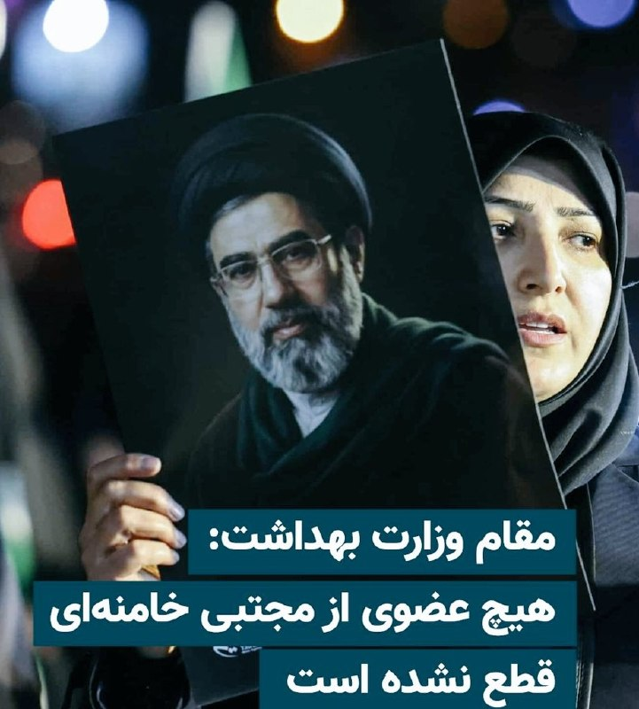

تراپی 😂😂😂😂😂😂😂😂

@Dirty_Kids 👻

## Dirty_Kids — post 389696

رادان گفته: از وقتی جنگ شروع شده 6500نفرو دستگیر کردیم، بازم میکنیم..

شش هزار و پانصد بار کُص ننت🖕

‌

@Dirty_Kids 👻

## Dirty_Kids — post 389695

  <a href="telegram/content/Dirty_Kids_389695_1779131638.mp4" target="_blank">🎬 Download video</a>

خیلی تاثیرگذار بود
آخرش قشنگ تموم شد

+ خیلی منطقی عربستان و پاکستان با خودشون جمع میبندن:)))) امروز پاکستان نیرو فرستاده عربستان واسه مقابله احتمالی

@Dirty_Kids 👻

## Hranews — post 113021

گزارشی از تجمع اعتراضی کارگران پتروشیمی پتروناد در بندرامام

❗️
❗️
❗️
❗️
❗️– روز جاری، گروهی از کارگران شرکت پتروشیمی پتروناد، در اعتراض به اخراج ۲۰۰ کارگر بومی این شرکت برای چهارمین روز متوالی در مقابل ساختمان فرمانداری بندرامام دست به #تجمع زدند.

ادامه مطلب

↘️
@hranews_bot تماس ✉️ - @Hranews کانال هرانا 🆑

## Hranews — post 113020

شیراز؛ ۲ شهروند به دلیل استفاده از استارلینک بازداشت شدند

❗️
❗️
❗️
❗️
❗️– فرمانده انتظامی شیراز از بازداشت دو تن به دلیل آنچه «استفاده از اینترنت ماهواره‌ای استارلینک و فروش اینترنت بدون فیلتر» عنوان کرد، خبر داد.

ادامه مطلب

↘️
@hranews_bot تماس ✉️ - @Hranews کانال هرانا 🆑

## Hranews — post 113019

اعتراضات دی‌ماه؛ تداوم بازداشت و بی‌خبری از سرنوشت آسو کیخسروی، نوجوان ۱۷ ساله

❗️
❗️
❗️
❗️
❗️– آسو کیخسروی، نوجوان ۱۷ ساله که در جریان اعتراضات دی ۱۴۰۴ در جوانرود بازداشت شده است، همچنان در بلاتکلیفی به‌سر می‌برد. بی‌خبری از سرنوشت وی علیرغم گذشت بیش از چهار ماه از زمان بازداشت، منجر به افزایش نگرانی‌های خانواده وی شده است.

ادامه مطلب

#آسو_کیخسروی #اعتراضات۱۴۰۴ #اعتراضات_بازار

↘️
@hranews_bot تماس ✉️ - @Hranews کانال هرانا 🆑

## manototv — post 105608

  <a href="telegram/content/manototv_105608_1779131640.mp4" target="_blank">🎬 Download video</a>

تماسی از ایران:
از سیروان شعبانی، ۲۲ ساله از اسلامشهر گفت…
استاد موسیقی که نوزدهم دی بازداشت شد و حالا در اوین است

## manototv — post 105607

  <a href="telegram/content/manototv_105607_1779131641.mp4" target="_blank">🎬 Download video</a>

دونالد ترامپ، رئیس‌جمهوری آمریکا، در گفت‌وگو با نیویورک پست اعلام کرد پس از دریافت تازه‌ترین پاسخ «ناامیدکننده» جمهوری اسلامی در مذاکرات مربوط به توافق صلح، «برای هیچ‌گونه امتیازدهی به تهران آمادگی ندارد.»

ترامپ همچنین در اظهاراتی هشدارآمیز گفت جمهوری اسلامی می‌داند «به‌زودی چه اتفاقی قرار است بیفتد.»

او در این گفت‌وگوی کوتاه تلفنی، به نظر می‌رسید پیشنهاد جمهوری اسلامی برای ادامه مذاکرات دیپلماتیک، که روز یکشنبه مطرح شده بود، را رد کرده است.

ترامپ در پاسخ به سوالی درباره اظهارات روز جمعه‌اش مبنی بر آمادگی برای پذیرش توقف ۲۰ ساله غنی‌سازی اورانیوم در ایران گفت: «در حال حاضر برای هیچ چیزی آمادگی ندارم.»

رئیس‌جمهوری آمریکا از ارائه جزئیات بیشتر خودداری کرد و گفت: «واقعاً نمی‌توانم درباره‌اش صحبت کنم. اتفاقات زیادی در حال رخ دادن است.»

بر اساس این گزارش، ترامپ پس از بازگشت از سفرش به چین، آخر هفته را در باشگاه گلف خود در ویرجینیا همراه با تیم امنیت ملی آمریکا به بررسی گام‌های بعدی درباره جمهوری اسلامی گذرانده است.

نیویورک پست نوشت انتظار می‌رود نشست‌های بیشتری روز سه‌شنبه برگزار شود؛ در حالی که برخی متحدان تندرو ترامپ، از جمله لیندسی گراهام، سناتور جمهوری‌خواه، از او خواسته‌اند با متوقف شدن روند دیپلماسی، عملیات نظامی علیه جمهوری اسلامی را از سر بگیرد.

ترامپ همچنین گفت از تهران «ناامید» نشده، اما تاکید کرد جمهوری اسلامی به‌خوبی می‌داند آمریکا توان وارد کردن «فشار و آسیب بیشتر» را دارد.

او گفت: «می‌توانم بگویم آن‌ها بیشتر از هر زمان دیگری می‌خواهند توافق کنند، چون می‌دانند ما… چه اتفاقی قرار است به‌زودی بیفتد.»

ترامپ در پاسخ به سوالی درباره گزارش‌هایی مبنی بر تلاش جمهوری اسلامی برای «وقت‌کشی» در موضوع هسته‌ای و بازگشایی تنگه هرمز گفت چنین چیزی نشنیده است.

او افزود: «چیزی نمی‌شنوم. نمی‌توانم درباره‌اش با شما صحبت کنم.»

ترامپ در پایان گفت: «این یک مذاکره است. نمی‌خواهم احمق باشم.»

## manototv — post 105606

  <a href="telegram/content/manototv_105606_1779131642.mp4" target="_blank">🎬 Download video</a>

تماسی از ایران:
« از جاویدنام علی اباذری می‌گفت…
با گذشت ماه‌ها، درد هنوز تازه‌ست؛ انگار همین دیروز اتفاق افتاده.»

## manototv — post 105605

  <a href="telegram/content/manototv_105605_1779131643.mp4" target="_blank">🎬 Download video</a>

ایرانیان مقیم مادرید امروز دوشنبه ۱۸ می، مقابل سفارت نروژ در پایتخت اسپانیا تجمع کردند. این تجمع در اعتراض به دیدار برخی سیاستمداران نروژی با مقام‌های جمهوری اسلامی و در حمایت از شاهزاده رضا پهلوی برگزار شد.

معترضان خواستار پایان دادن به مماشات با جمهوری اسلامی و شنیده شدن صدای مردم ایران شدند.

## manototv — post 105604

  <a href="telegram/content/manototv_105604_1779131644.mp4" target="_blank">🎬 Download video</a>

‌
داده‌های ردیابی پروازها نشان می‌دهد انتقال هوایی تجهیزات و نیروهای نظامی آمریکا به خاورمیانه همچنان ادامه دارد.

بر اساس گزارش الجزیره از داده‌های پروازی، دست‌کم ۲۶ پرواز نظامی آمریکا بین ۱۵ تا ۱۷ مه از آلمان به مقصد خاورمیانه انجام شده است.

این گزارش می‌گوید این جابه‌جایی‌ها همزمان با افزایش حضور نظامی آمریکا در اطراف تنگه هرمز، دریای عمان و دریای عرب انجام شده است.

بر اساس داده‌های ردیابی، تمام پروازهای ثبت‌شده با هواپیماهای نظامی «بوئینگ سی-۱۷ اِی گلوب‌مستر ۳» انجام شده‌اند؛ هواپیماهای ترابری سنگینی که نیروی هوایی آمریکا از آن‌ها برای انتقال نیرو و تجهیزات نظامی استفاده می‌کند.

## manototv — post 105603

  <a href="telegram/content/manototv_105603_1779131645.mp4" target="_blank">🎬 Download video</a>

‌
وزارت خزانه‌داری آمریکا اعلام کرد مجوزی عمومی و موقت ۳۰ روزه صادر کرده تا «آسیب‌پذیرترین کشورها» بتوانند به‌طور موقت به نفت روسیه‌ای که در دریا سرگردان مانده، دسترسی پیدا کنند.

وزارت خزانه‌داری آمریکا گفت این تمدید «انعطاف‌پذیری بیشتری» فراهم می‌کند و واشینگتن در صورت نیاز، مجوزهای مشخص‌تری نیز برای این کشورها صادر خواهد کرد.

در این بیانیه آمده است این مجوز عمومی به «ثبات بازار فیزیکی نفت خام» کمک می‌کند و تضمین می‌کند نفت به کشورهایی برسد که بیشترین آسیب‌پذیری را در حوزه انرژی دارند.

وزارت خزانه‌داری آمریکا همچنین اعلام کرد این اقدام با کاهش توانایی چین برای انبار کردن نفت ارزان‌قیمت، به هدایت دوباره عرضه موجود به سمت کشورهای نیازمند کمک خواهد کرد.

## alonews — post 120944

  <a href="telegram/content/alonews_120944_1779131645.webm" target="_blank">🎬 Download video</a>

🔴فوری/ترامپ: حمله به ایران را که قرار بود فردا انجام دهم به تعویق انداختم

✅ @AloNews خبر جنگ

## alonews — post 120943

  <a href="telegram/content/alonews_120943_1779131646.mp4" target="_blank">🎬 Download video</a>

👈خضریان، عضو کمیسیون امنیت ملی مجلس: خیلی از مسئولان ارشد نظام معتقد دارند که باید در مقابل اقدام محاصره نظامی آمریکا، پاسخ نظامی به اسرائیل و آمریکا بدهیم

✅ @AloNews خبر جنگ

## alonews — post 120942

  <a href="telegram/content/alonews_120942_1779131648.webm" target="_blank">🎬 Download video</a>

👈پدافند هوایی جزیره قشم فعال شد

✅ @AloNews خبر جنگ

## alonews — post 120941

  <a href="telegram/content/alonews_120941_1779131648.webm" target="_blank">🎬 Download video</a>

👈یک مقام اسرائیلی می‌گوید ایرانیان در حالتی از سرخوشی به سر می‌برند، خود را پیروز نهایی می‌پندارند و معتقدند تهدیدهای ترامپ جدی نیست و او تمایل واقعی برای درگیری در جنگی جدید ندارد، طبق گزارش ی یدحوت احرونت.

✅ @AloNews خبر جنگ

## alonews — post 120940

  <a href="telegram/content/alonews_120940_1779131648.mp4" target="_blank">🎬 Download video</a>

👈اردوغان، رئیس جمهور ترکیه : امروز دوباره دیدیم اسرائیل با یه طرز فکر فاشیستی اداره میشه
- نیروهای اسرائیلی به «ناوگان جهانی صمود» که کمک‌های انسانی برای غزه می‌برد، تو آب‌های بین‌المللی حمله کردن
- این کار دزدی دریایی و راهزنیه و من شدیداً محکومش می‌کنم،مخصوصاً چون سرنشین‌هاش از ۴۰ کشور مختلف بودن
- ما اعلام میکنیم که، کنار مردم غزه هستیم

✅ @AloNews خبر جنگ

## alonews — post 120939

  <a href="telegram/content/alonews_120939_1779131650.webm" target="_blank">🎬 Download video</a>

👈پزشکیان: گفت‌وگو به معنای تسلیم نیست

✅ @AloNews خبر جنگ

## alonews — post 120938

  <a href="telegram/content/alonews_120938_1779131650.webm" target="_blank">🎬 Download video</a>

👈فارس: قلب اینترنت جهان در دست ایران است

✅ @AloNews خبر جنگ

## alonews — post 120937

  <a href="telegram/content/alonews_120937_1779131650.webm" target="_blank">🎬 Download video</a>

👈مرکز آمار کشور:در اردیبهشت امسال، گوجه فرنگی و خیار بیشترین میزان تورم را تجربه کرده‌اند و تخم مرغ رتبه سوم را در اختیار دارد

✅ @AloNews خبر جنگ

## alonews — post 120936

  <a href="telegram/content/alonews_120936_1779131650.webm" target="_blank">🎬 Download video</a>

👈ترامپ: اگر فرد اشتباهی جانشین من شود، برای آمریکا فاجعه خواهد بود

🔴رئیس‌جمهور آمریکا در مصاحبه‌ای که روز دوشنبه منتشر شد، گفت اگر پس از پایان دوره ریاست‌جمهوری‌اش «فرد اشتباهی» قدرت را به دست بگیرد، این موضوع برای ایالات متحده فاجعه‌بار خواهد بود.

✅ @AloNews خبر جنگ

## alonews — post 120935

  <a href="telegram/content/alonews_120935_1779131651.webm" target="_blank">🎬 Download video</a>

👈معاون اجرایی رئیس‌جمهور: بر اساس نظرسنجی مرکز ریاست‌جمهوری، ۷۰ درصد مردم نسبت به محدودیت اینترنت ناراضی هستند

✅ @AloNews خبر جنگ

## alonews — post 120934

  <a href="telegram/content/alonews_120934_1779131651.webm" target="_blank">🎬 Download video</a>

👈سالار آبنوش(ولایتمدار): آمریکا اگه تسلیم نشه باید منتظر موشک‌ها باشه

✅ @AloNews خبر جنگ

## alonews — post 120933

  <a href="telegram/content/alonews_120933_1779131651.mp4" target="_blank">🎬 Download video</a>

👈جی‌دی ونس:

ترامپ لباس‌های محافظه‌کارانه‌تر را دوست دارد. من این موضوع را به سختی سال گذشته یاد گرفتم، زیرا سنت این است که معاون رئیس‌جمهور نخست‌وزیر ایرلند را در روز سنت پاتریک خوش‌آمد بگوید.

من تصمیم گرفتم جوراب‌های چهاربرگ شام‌روک بپوشم تا نخست‌وزیر ایرلند را خوش‌آمد بگویم. ما در برابر خدا و همه مردم — احتمالاً صد دوربین تلویزیونی در جریان یک کنفرانس خبری زنده — نشسته بودیم و رئیس‌جمهور شروع به بیان سخنان خود کرد، سپس نگاه کرد و گفت: «با آن جوراب‌ها چه خبر است؟»

پس به سختی یاد گرفتم: در اطراف رئیس‌جمهور ایالات متحده به صورت محافظه‌کارانه لباس بپوشید.

✅ @AloNews خبر جنگ

## alonews — post 120932

  <a href="telegram/content/alonews_120932_1779131653.webm" target="_blank">🎬 Download video</a>

👈عبدالمالکی، وزیر رفاه رئیسی: ایران هیچوقت دچار ابرتورم نمیشه چون وقتی یه چیزی گرون بشه مردم پولشون نمیرسه بخرن و فروشنده گرون نمیکنه

✅ @AloNews خبر جنگ

## alonews — post 120931

  <a href="telegram/content/alonews_120931_1779131653.webm" target="_blank">🎬 Download video</a>

👈شبکه ۷ اسرائیل: امریکن ایرلاینز توقف پروازهای مسیر نیویورک به تل‌آویو را تا سال ۲۰۲۷ تمدید کرد

✅ @AloNews خبر جنگ

## alonews — post 120930

  <a href="telegram/content/alonews_120930_1779131653.mp4" target="_blank">🎬 Download video</a>

🔴اینا بهتر از من و شما میدونن آخرش چه شکلیه برای همین دارن مزدوراشون رو آموزش میدن برای جنگ شهری.

🔴این صورت ها را به‌خاطر بسپارید. همسایتونه؟ کاسب محل؟ فامیل؟

🤔اینها قاتلین فرزندان ایران هستند. نه‌می بخشیم نه فراموش می‌کنیم.

✅@AloNews

## alonews — post 120929

  <a href="telegram/content/alonews_120929_1779131655.webm" target="_blank">🎬 Download video</a>

👈خبرآنلاین: برخی شواهد نشان می‌دهد کشورهای عربی در کنار ترامپ در حال لابی گسترده علیه جمهوری اسلامی در چین هستند.

🔴این کشورها به چین قول داده‌اند نفت آن کشور را تامین کرده و کالاهای صادراتی آن را به قیمت‌های بالاتر و نامتعارف خریداری کنند.

✅ @AloNews خبر جنگ

## alonews — post 120928

  <a href="telegram/content/alonews_120928_1779131655.mp4" target="_blank">🎬 Download video</a>

👈 یک زوج حامی حکومت در برنامه صداوسیما اعلام کردند مهریه عروس یک «پهپاد شاهد» تعیین شده است.

🔴در این برنامه تلویزیونی، داماد گفت امیدوار است این پهپاد «به قلب اسرائیل اصابت کند.»

این اظهارات در حالی مطرح شد که در هفته‌های اخیر، استفاده نمادین از پهپادها و تجهیزات نظامی در تجمع‌ها و برنامه‌های رسانه‌ای جمهوری اسلامی افزایش یافته است.

✅ @AloNews خبر جنگ

## alonews — post 120925

  <a href="telegram/content/alonews_120925_1779131656.webm" target="_blank">🎬 Download video</a>

👈روز گذشته در غرب جزیره هرمز یک نفتکش در حال نشت مشاهده شد

✅ @AloNews خبر جنگ

<!-- MSG END -->

<!-- NAV START -->

<a href="https://github.com/AlirezaGh1993/aio-downloader/blob/main/telegram/content/archive_1.md" style="display:inline-block; padding:6px 12px; margin:0 4px; background-color:#2ea44f; color:white; text-decoration:none; border-radius:4px; font-weight:bold;">صفحه بعد</a>

<!-- NAV END -->
